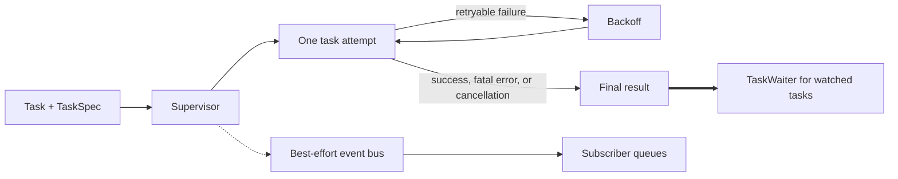
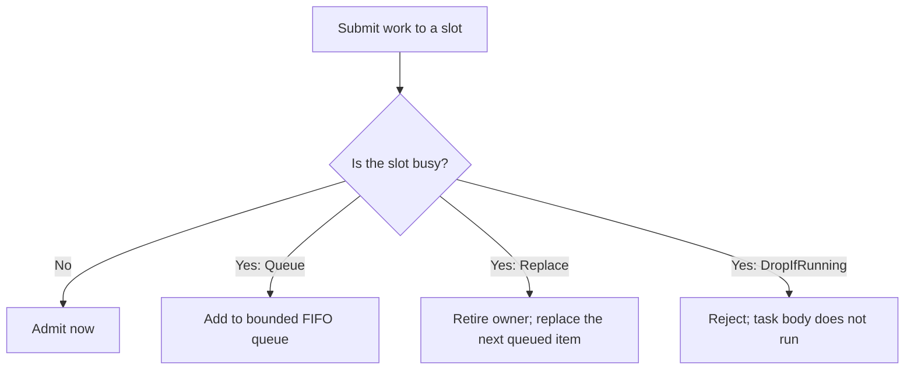

# Taskvisor

[](https://crates.io/crates/taskvisor)
[](https://docs.rs/taskvisor)
[](https://rust-lang.org)
[](./LICENSE)

Supervision for long-running Tokio tasks.

Taskvisor starts async tasks, restarts them after failures, and stops them during shutdown. It also reports each lifecycle step through typed events. Your task stays a normal async function. You do not need to build a retry loop around it.

- [Quick start](#quick-start)
- [Core model](#core-model)
- [Task behavior](#choose-task-behavior)
- [Cancellation and shutdown](#cancellation-and-shutdown)
- [Events and outcomes](#events-and-outcomes)
- [Admission control](#admission-control-feature-controller)
- [Production limits](#production-limits)
- [Examples](#examples)

## The problem

A long-running worker often needs more than `tokio::spawn`:

- retries with backoff and jitter,
- a limit on retry attempts,
- a timeout for each attempt,
- cooperative cancellation,
- a grace period before force-abort,
- stable task identity,
- lifecycle events for logs and metrics,
- a final result that callers can await.

These parts are easy to write once. They are harder to keep correct during races and shutdown. Taskvisor keeps this lifecycle in one place.

Taskvisor is a good fit for queue consumers, pollers, sync loops, connection keepers, periodic jobs, and other tasks that live with the service.

It is not a job store, a distributed scheduler, an actor system, or a replacement for Tokio. It does not make work durable across process restarts.

## Quick start

```toml
[dependencies]
taskvisor = "0.5"
tokio = { version = "1", features = ["full"] }
```

This worker polls every five seconds. It observes cancellation through `TaskContext`. In static mode, Taskvisor handles the process shutdown signal and waits for the worker to stop.

```rust,no_run
use std::time::Duration;
use taskvisor::prelude::*;

#[tokio::main]
async fn main() -> Result<(), Box<dyn std::error::Error>> {
    let worker = TaskFn::arc("orders", |ctx| async move {
        loop {
            ctx.run_until_cancelled(tokio::time::sleep(Duration::from_secs(5)))
                .await?;

            println!("poll orders");
        }
    });

    let supervisor = Supervisor::new(SupervisorConfig::default(), vec![]);
    supervisor
        .run(vec![TaskSpec::restartable(worker)])
        .await?;

    Ok(())
}
```

`TaskSpec::restartable` stops after success. It restarts after a retryable error. The default backoff has a base delay of 200 ms. It grows to 30 seconds and uses equal jitter.

## Core model

Four types form the main API:

| Type | Purpose |
|---|---|
| `TaskFn` or `Task` | The async work. A new future is created for every attempt. |
| `TaskSpec` | Restart policy, backoff, timeout, and retry limit. |
| `Supervisor` | Owns task lifecycle, shutdown, and event delivery. |
| `SupervisorHandle` | Adds, removes, cancels, and watches tasks at runtime. |



Retries for one task run in sequence. Two attempts for the same `TaskId` do not run at the same time. A global concurrency limit can restrict attempts across the whole supervisor.

Active task names must be unique. A `TaskId` identifies one add request or controller submission. Reusing the same name later creates a new `TaskId`.

## Choose task behavior

The named constructors cover the common cases:

| Constructor | After `Ok(())` | After a retryable failure |
|---|---|---|
| `TaskSpec::once(task)` | Stop | Stop |
| `TaskSpec::restartable(task)` | Stop | Retry with backoff |
| `TaskSpec::periodic(task, every)` | Wait `every`, then run again | Retry with backoff |

Fatal errors and cancellation always stop the task. A periodic interval starts after a successful attempt finishes. It is not a wall-clock or cron schedule.

### Return values

| Task result | Meaning |
|---|---|
| `Ok(())` | The attempt succeeded. The restart policy decides whether to run again. |
| `Err(TaskError::fail(reason))` | Retryable failure. Use `fail_from(error)` to keep the source error. |
| `Err(TaskError::fatal(reason))` | Permanent failure. Do not restart. |
| `Err(TaskError::Canceled)` | Cooperative stop. Treat it as cancellation, not failure. |
| Attempt timeout | Taskvisor creates a retryable `TaskError::Timeout`. |
| Panic in the task future, with panic unwinding enabled | Taskvisor catches it and creates a retryable failure. |

A retry limit counts retries after the first failed attempt. For example, `max_retries = 3` allows at most four attempts when every attempt fails.

```rust,no_run
use std::num::NonZeroU32;
use std::time::Duration;
use taskvisor::{BackoffPolicy, JitterPolicy, TaskSpec};

# fn configure(task: taskvisor::TaskRef) {
let spec = TaskSpec::restartable(task)
    .with_backoff(
        BackoffPolicy::exponential(Duration::from_millis(200))
            .with_max(Duration::from_secs(30))
            .with_jitter(JitterPolicy::Equal),
    )
    .with_timeout(Duration::from_secs(10))
    .with_max_retries(NonZeroU32::new(3).unwrap());
# let _ = spec;
# }
```

Equal jitter chooses each real delay between half of the current base delay and the full base delay. This helps prevent many failed tasks from retrying at the same moment.

`TaskSpec` settings override `TaskDefaults`. Settings not defined by the spec are inherited when the task is admitted.

## Cancellation and shutdown

Cancellation is cooperative first. A long-running task must observe `TaskContext`:

```rust,ignore
// Recommended for one fallible operation.
let result = ctx.run_until_cancelled(do_work()).await?;
result?;

// Use select! when the task needs more branches.
tokio::select! {
    _ = ctx.cancelled() => Err(TaskError::Canceled),
    result = do_work() => result,
}
```

There are two runtime modes:

| Mode | Use it when | Shutdown owner |
|---|---|---|
| `supervisor.run(specs)` | Tasks are known at startup | Taskvisor waits for completion or an OS signal. |
| `supervisor.serve()` | Tasks are added at runtime | Your code calls `handle.shutdown().await`. |

On Unix, static mode listens for `SIGINT`, `SIGTERM`, and `SIGQUIT`. On other systems, it listens for Ctrl+C.

The shutdown sequence is:

1. Close admission for new work.
2. Send cancellation to active tasks.
3. Wait for the configured `grace` period.
4. Force-abort tasks that did not stop.
5. Drain subscriber queues for their separate shutdown timeout.

Call `handle.shutdown().await` to wait for cleanup and receive its result. Dropping the last public owner only starts non-blocking cancellation. It cannot report cleanup errors.

Dynamic management uses `TaskId`:

```rust,ignore
let handle = supervisor.serve();

let id = handle.add(spec).await?;
let tasks = handle.list().await;       // Vec<(TaskId, name)>
let stopped = handle.cancel(id).await?;

handle.shutdown().await?;
```

`add().await?` means the registry accepted the task. It does not mean the task completed. The `try_*` methods use the same operations but fail fast when a command queue is full.

## Events and outcomes

Taskvisor has two result paths. They solve different problems.

| Path | Delivery | Use it for |
|---|---|---|
| `Event` through `Subscribe` | Best-effort | Logs, metrics, traces, and live status. |
| `TaskOutcome` through `TaskWaiter` | One final result, separate from the event bus | Business logic that must know how a watched task ended. |

Use `add_and_watch` when the final result matters:

```rust,ignore
let (id, waiter) = handle
    .add_and_watch(TaskSpec::once(job))
    .await?;

match waiter.wait().await? {
    TaskOutcome::Completed => println!("{id} completed"),
    TaskOutcome::Failed { reason, .. } => eprintln!("{id} failed: {reason}"),
    TaskOutcome::Canceled => eprintln!("{id} was canceled"),
    other => eprintln!("{id} ended with {other:?}"),
}
```

Add subscribers when operators need lifecycle data:

```rust,no_run
use std::sync::Arc;
use taskvisor::{Event, EventKind, Subscribe, Supervisor, SupervisorConfig};

struct FailureLog;

impl Subscribe for FailureLog {
    fn on_event(&self, event: &Event) {
        if event.kind == EventKind::TaskFailed {
            eprintln!(
                "task={} failed: {}",
                event.task.as_deref().unwrap_or("unknown"),
                event.reason.as_deref().unwrap_or("unknown reason"),
            );
        }
    }

    fn name(&self) -> &str {
        "failure-log"
    }
}

let subscribers: Vec<Arc<dyn Subscribe>> = vec![Arc::new(FailureLog)];
let supervisor = Supervisor::new(SupervisorConfig::default(), subscribers);
# let _ = supervisor;
```

Events include a global sequence number and, where relevant, task identity, attempt number, duration, reason, timeout, delay, and exit code. Event variants are typed. Stable string labels are available for telemetry.

Each subscriber has its own bounded FIFO queue. Its synchronous callback runs on Tokio's blocking pool. A slow subscriber cannot block event publishers, but its queue can fill. New events may then be dropped for that subscriber. Keep callbacks short and send async work to another channel.

The optional `tracing` feature provides `TracingBridge`. The repository also has a [Prometheus metrics example](examples/metrics.rs). Taskvisor does not install a metrics recorder or exporter for the application.

## Admission control (feature: `controller`)

The controller groups submissions into named slots. At most one task can occupy a slot. Different slots can run at the same time.



| Policy | Busy-slot behavior | Typical use |
|---|---|---|
| `Queue` | Wait in a bounded FIFO queue. | Ordered work for one resource. |
| `Replace` | Retire the current owner and replace the queue head with the new submission. | Work where the next value must be fresh. |
| `DropIfRunning` | Reject the new submission. | Work that must not overlap. |

The slot defaults to the task name. Use `with_slot` to place tasks with different names in the same lane.

```rust,ignore
let supervisor = Supervisor::builder(SupervisorConfig::default())
    .with_controller(ControllerConfig::default())
    .build();
let handle = supervisor.serve();

let request = ControllerSpec::queue(TaskSpec::once(job))
    .with_slot("customer-42");
let (_id, waiter) = handle.submit_and_watch(request).await?;
let outcome = waiter.wait().await?;
```

`submit().await?` means the controller accepted the command. Admission happens later. Use `submit_and_watch` to receive the final result. If the controller never admits the submission, the result is `TaskOutcome::Rejected`. If it admits the task, the result describes how that task ended.

`Queue` depth is limited per slot. A `Replace` submission can occupy the queue
head even when the FIFO limit is zero. `controller_snapshot()` returns the
current slot status and queue depth without parsing events.

`Replace` changes only the queue head. FIFO items already behind that head stay
queued.

See [slots.rs](examples/slots.rs) and [admission.rs](examples/admission.rs).

## Configuration

Runtime limits and task defaults are separate:

```rust,no_run
use std::num::{NonZeroU32, NonZeroUsize};
use std::time::Duration;
use taskvisor::{Supervisor, SupervisorConfig, TaskDefaults};

let runtime = SupervisorConfig::default()
    .with_grace(Duration::from_secs(30))
    .with_subscriber_shutdown_timeout(Duration::from_secs(5))
    .with_max_concurrent(NonZeroUsize::new(16));

let tasks = TaskDefaults::default()
    .with_timeout(Duration::from_secs(20))
    .with_max_retries(NonZeroU32::new(5).unwrap());

let supervisor = Supervisor::builder(runtime)
    .with_task_defaults(tasks)
    .build();
# let _ = supervisor;
```

Main defaults:

| Setting | Default |
|---|---|
| Graceful task shutdown | 60 seconds |
| Subscriber drain | 5 seconds, shared by all subscriber queues |
| Global task-attempt concurrency | Unlimited |
| Event bus capacity | 1024 |
| Registry command capacity | 1024 |
| Restart policy | On failure |
| Failure backoff | Exponential: 200 ms to 30 seconds, equal jitter |
| Attempt timeout | None |
| Failure retry limit | Unlimited |

Capacity types are non-zero where zero would make the runtime unusable. Checked `try_with_*` setters are available for raw values.

## Production limits

Taskvisor defines the in-process lifecycle of a task. Keep these limits clear:

- Events are best-effort. Do not use them as a durable audit log.
- Watched outcomes are not durable after the process exits.
- Cancellation depends on the task reaching an await point that observes `TaskContext`. Force-abort cannot stop synchronous code that blocks a runtime thread.
- Subscriber callbacks may still be running on Tokio's blocking pool when their drain deadline is reached. Tokio runtime shutdown may wait for such callbacks.
- Periodic tasks use an interval after completion. They do not provide calendar scheduling or missed-run recovery.
- The controller coordinates tasks inside one supervisor. It does not coordinate several processes or hosts.
- With `panic = "unwind"`, Taskvisor catches panics in the task future. It
  cannot recover from `panic = "abort"`, process aborts, memory exhaustion, or
  failures outside the process.

For a service deployment:

- call the joined shutdown path,
- make every resident task cancellation-aware,
- set finite timeouts and retry limits where endless retry is unsafe,
- add a `Subscribe` implementation or `TracingBridge`,
- monitor `TaskFailed`, `BackoffScheduled`, `GraceExceeded`, and `SubscriberOverflow`,
- use watched outcomes when application logic depends on completion.

The crate forbids unsafe Rust with `#![forbid(unsafe_code)]`.

## Feature flags

Taskvisor has no default features.

| Feature | Adds |
|---|---|
| `controller` | Slot-based admission control. |
| `tracing` | `TracingBridge` for the `tracing` ecosystem. |
| `logging` | `LogWriter`, a simple event writer for demos and small tools. |
| `tokio-util-interop` | Access to the raw cancellation token in `TaskContext`. |
| `test-util` | Helpers for testing code that integrates with Taskvisor. |

```toml
taskvisor = { version = "0.5", features = ["controller", "tracing"] }
```

## Examples

Run the smallest example:

```bash
cargo run --example basic
```

| Example | What it shows |
|---|---|
| [basic.rs](examples/basic.rs) | One task, one run, one exit. |
| [worker.rs](examples/worker.rs) | A long-running worker with graceful cancellation. |
| [periodic.rs](examples/periodic.rs) | Repeated execution after an interval. |
| [multiple.rs](examples/multiple.rs) | Several restart policies in one supervisor. |
| [queue_consumer.rs](examples/queue_consumer.rs) | Reconnect after a consumer failure. |
| [cpu_job.rs](examples/cpu_job.rs) | Supervise CPU-heavy work without blocking Tokio workers. |
| [subscriber.rs](examples/subscriber.rs) | Handle typed lifecycle events. |
| [tracing.rs](examples/tracing.rs) | Forward events to `tracing` (`tracing` feature). |
| [metrics.rs](examples/metrics.rs) | Build Prometheus counters from events. |
| [dynamic.rs](examples/dynamic.rs) | Add, list, cancel, and remove tasks at runtime. |
| [outcomes.rs](examples/outcomes.rs) | Await the final result of a task. |
| [slots.rs](examples/slots.rs) | Compare controller policies (`controller` feature). |
| [admission.rs](examples/admission.rs) | Observe admission and rejection (`controller` feature). |

The released API reference is on [docs.rs](https://docs.rs/taskvisor). For the
current checkout, run `cargo doc --all-features --open`.

## Performance

Run benchmarks on your own hardware:

```bash
cargo bench
cargo bench --bench controller --features controller
```

## Contributing

Issues and pull requests are welcome. Read the [contributing guide](https://github.com/soltiHQ/.github/blob/main/CONTRIBUTING.md) before a large change.

Taskvisor is licensed under [Apache-2.0](LICENSE).
