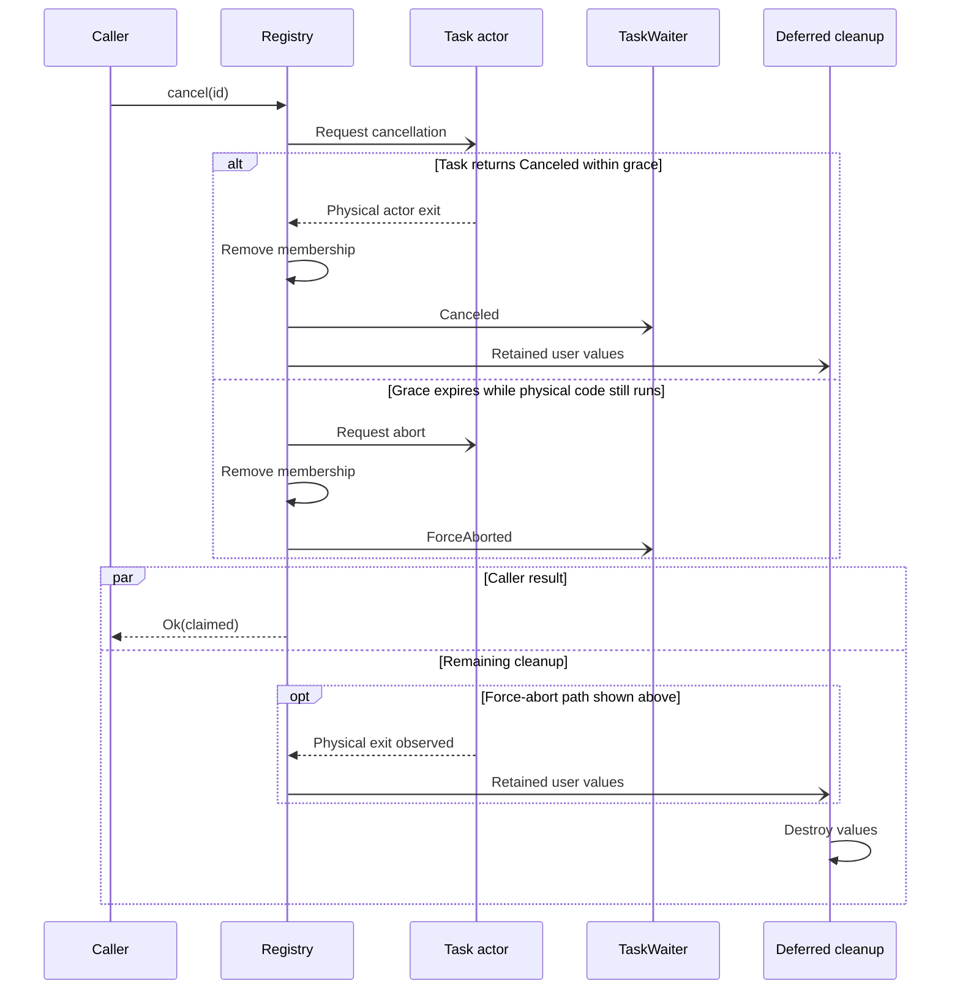

# Cancellation and shutdown

## Make operations cancellation-aware

Cancellation starts cooperatively.
A resident task must observe [`TaskContext`](https://docs.rs/taskvisor/latest/taskvisor/tasks/struct.TaskContext.html):

```rust
use taskvisor::{TaskContext, TaskError};

async fn do_work() -> Result<(), TaskError> {
    // Application work goes here.
    Ok(())
}

async fn run_one_operation(ctx: &TaskContext) -> Result<(), TaskError> {
    ctx.run_until_cancelled(do_work()).await?
}

async fn run_with_more_branches(ctx: &TaskContext) -> Result<(), TaskError> {
    tokio::select! {
        _ = ctx.cancelled() => Err(TaskError::Canceled),
        result = do_work() => result,
    }
}
```

[`run_until_cancelled`](https://docs.rs/taskvisor/latest/taskvisor/tasks/struct.TaskContext.html#method.run_until_cancelled) drops the wrapped future when cancellation wins.
Cancellation wins a tie. An already-cancelled context does not poll the wrapped future.
Use it only when dropping that future is a safe way to cancel the exact operation.
Check the operation's cancellation-safety contract.
An external commit, acknowledgement, or partly consumed input may need an explicit protocol.
The Tokio sleep in [graceful_worker.rs](../examples/graceful_worker.rs) is a simple drop-safe example.
See the [context implementation](../src/tasks/context.rs) for cancellation priority and child scopes.

## Know which deadline you are setting

Taskvisor deadlines cover different waits:

| API or setting | What it bounds | What expiry means |
|----------------|----------------|-------------------|
| [`TaskSpec::with_timeout`](https://docs.rs/taskvisor/latest/taskvisor/tasks/struct.TaskSpec.html#method.with_timeout) or [`TaskDefaults::with_timeout`](https://docs.rs/taskvisor/latest/taskvisor/core/struct.TaskDefaults.html#method.with_timeout) | One attempt after `Task::spawn` returns its future. | Cancel the attempt context and destroy the future. The timeout is retryable under policy if cleanup succeeds. |
| `add*_with_ownership_timeout` | Ownership admission before registry command commit. | Return `RuntimeError::OwnershipAdmissionTimeout`. Start no task and publish no lifecycle event for the request. |
| `submit*_with_ownership_timeout` | Ownership admission before controller command intake. | Return `ControllerError::OwnershipAdmissionTimeout`. Later queues, admission, and execution are outside this deadline. |
| `cancel*_with_timeout` | This caller's terminal wait after the registry claim. | Return `RuntimeError::TaskTerminationTimeout`. The cancellation request remains active. |
| [`with_grace`](https://docs.rs/taskvisor/latest/taskvisor/core/struct.SupervisorConfig.html#method.with_grace) for `remove` or `cancel` | One registered task's cooperative stop after a new claim. | Request abort and commit `ForceAborted`. `cancel` still returns its claim boolean. |
| `with_grace` for shutdown | One shared drain of tasks and pending removals. | Return `RuntimeError::GraceExceeded` if work did not drain in time. Commit force-abort where needed. |
| [`with_subscriber_shutdown_timeout`](https://docs.rs/taskvisor/latest/taskvisor/core/struct.SupervisorConfig.html#method.with_subscriber_shutdown_timeout) | The separate shared drain of subscriber queues. | Drop queued events after the deadline. A callback already running cannot be interrupted. |

Both ownership-admission timeouts happen before command intake.
Neither starts work or publishes a lifecycle event for the request.
See [management intake](managing-tasks.md#choose-waiting-bounded-ownership-or-fail-fast-intake) for the ownership timeout methods.
These deadlines are not interchangeable.
None rolls back external side effects. Timers cannot interrupt synchronous Rust code in the middle of a poll.

## Understand attempt timeouts

The [attempt runner](../src/core/runner.rs) starts the timeout after `Task::spawn` returns its future.
On expiry, it cancels the attempt context and drops the future.
It does not poll the future again to run async cleanup or undo side effects.
A blocking future destructor can delay attempt release beyond the configured timeout.

## Stop one registered task

[`remove`](https://docs.rs/taskvisor/latest/taskvisor/core/struct.SupervisorHandle.html#method.remove) requests a stop and returns its claim boolean without waiting for terminal cleanup.
[`cancel`](https://docs.rs/taskvisor/latest/taskvisor/core/struct.SupervisorHandle.html#method.cancel) waits until registry membership is removed and the final outcome is committed.
Both use the configured grace period when they create a new stop claim for registered work.

If the task does not stop within grace, Taskvisor requests abort and commits `ForceAborted`.
A plain `cancel` can then return `Ok(true)`. It does not return `GraceExceeded` for this task.
A `cancel` that joins an existing removal waits for the same cleanup and returns `Ok(false)`.
Use a `TaskWaiter` to learn the task's final outcome; the boolean reports only who made the stop claim.

The [registry stop commands](../src/core/registry/removal/commands.rs) create or join the claim.
The [join reporter](../src/core/registry/removal/join.rs) applies the task's grace period.

## Cancel work with a caller deadline

[`cancel_with_timeout`](https://docs.rs/taskvisor/latest/taskvisor/core/struct.SupervisorHandle.html#method.cancel_with_timeout) and [`cancel_by_name_with_timeout`](https://docs.rs/taskvisor/latest/taskvisor/core/struct.SupervisorHandle.html#method.cancel_by_name_with_timeout) limit how long the caller waits for registered task cleanup.
Controller ordering, command-queue admission, and the registry claim happen outside that timer.
A timeout stops this caller's wait. It does not undo cancellation or change the task grace period.
If task completion is observed at the timeout boundary, completion wins.
Queued controller work is removed directly, and `cancel_with_timeout` does not apply its wait timer to that path.
A watched queued submission then resolves to `Rejected` with [`RejectionKind::RemovedFromQueue`](https://docs.rs/taskvisor/latest/taskvisor/events/enum.RejectionKind.html#variant.RemovedFromQueue), not to `Canceled`.
The matching `try_*` methods make command-queue admission fail fast. Their remaining behavior is unchanged.
If the caller already holds a `TaskWaiter`, a `TaskTerminationTimeout` neither consumes nor cancels it.
The waiter can still deliver the eventual terminal outcome.
See the [caller-wait implementation](../src/core/runtime/management/cancel.rs).

## Join shutdown

[`handle.shutdown().await`](https://docs.rs/taskvisor/latest/taskvisor/core/struct.SupervisorHandle.html#method.shutdown) joins one shared shutdown workflow.
It affects the whole runtime and every handle clone.
Concurrent and later callers receive the same cached result.

The workflow has concurrent parts:

- It closes admission and signals shutdown.
- It waits for earlier committed registry commands before starting the task grace window.
- The registry requests cancellation and spends one shared grace period on tasks and pending removals.
- The controller rejects pending submissions as its loop exits. This can overlap the registry grace period.
- Taskvisor joins runtime and controller cleanup, then drains subscriber queues up to their separate deadline.

If task cleanup exceeds grace, shutdown reports `RuntimeError::GraceExceeded` and force-aborts work as needed.
The [shutdown coordinator](../src/core/runtime/shutdown_workflow/mod.rs) owns the shared result.
The [cleanup workflow](../src/core/runtime/shutdown_workflow/cleanup.rs) owns the drain order and deadlines.

After a shutdown future is first polled, dropping that caller's future does not stop the detached workflow.
Its return does not prove that force-aborted synchronous code, a running subscriber callback, or a user destructor has finished.
Dropping the final public owner can request cancellation, but a destructor cannot await cleanup or report errors.

## Separate logical completion from physical release

This diagram follows one watched, registered task after cancellation reaches the registry.
It shows a cooperative stop and one possible force-abort path. Controller routing and queued work are not shown.



The force-abort branch shows logical completion before physical exit.
Physical exit can also happen earlier. Final destruction and the caller receiving its result have no fixed order.
The [terminal commit](../src/core/registry/removal/terminal.rs) removes membership and sends the outcome.
The [attempt reaper](../src/core/registry/scheduler/reaper.rs) retains force-aborted actors until physical release.

Taskvisor exposes separate views for these stages:

| Question                                           | Interface                            |
|----------------------------------------------------|--------------------------------------|
| What final logical result did watched work reach? | [`TaskWaiter`](https://docs.rs/taskvisor/latest/taskvisor/core/struct.TaskWaiter.html) and [`TaskOutcome`](https://docs.rs/taskvisor/latest/taskvisor/core/enum.TaskOutcome.html) |
| Is the task still registered? | [`list`](https://docs.rs/taskvisor/latest/taskvisor/core/struct.SupervisorHandle.html#method.list) |
| Is a physical attempt still active? | [`alive_snapshot`](https://docs.rs/taskvisor/latest/taskvisor/core/struct.SupervisorHandle.html#method.alive_snapshot) and [`is_alive`](https://docs.rs/taskvisor/latest/taskvisor/core/struct.SupervisorHandle.html#method.is_alive) |
| Are user values retained or awaiting destruction? | [`ownership_snapshot`](https://docs.rs/taskvisor/latest/taskvisor/core/struct.SupervisorHandle.html#method.ownership_snapshot) |

After `ForceAborted`, a task can be absent from `list` while its name remains in `alive_snapshot`.
After physical exit, the name can leave `alive_snapshot` while ownership is still in use.
Its ownership unit stays charged until the retained user values finish isolated destruction.
A destructor panic permanently retires that unit from finite capacity instead of releasing it.

These snapshots can become stale immediately. They are not one atomic per-task record.
See [Configure Taskvisor](configuration.md#observe-ownership-pressure) for the ownership fields and [Final outcomes and lifecycle events](outcomes-and-events.md) for outcome semantics.
