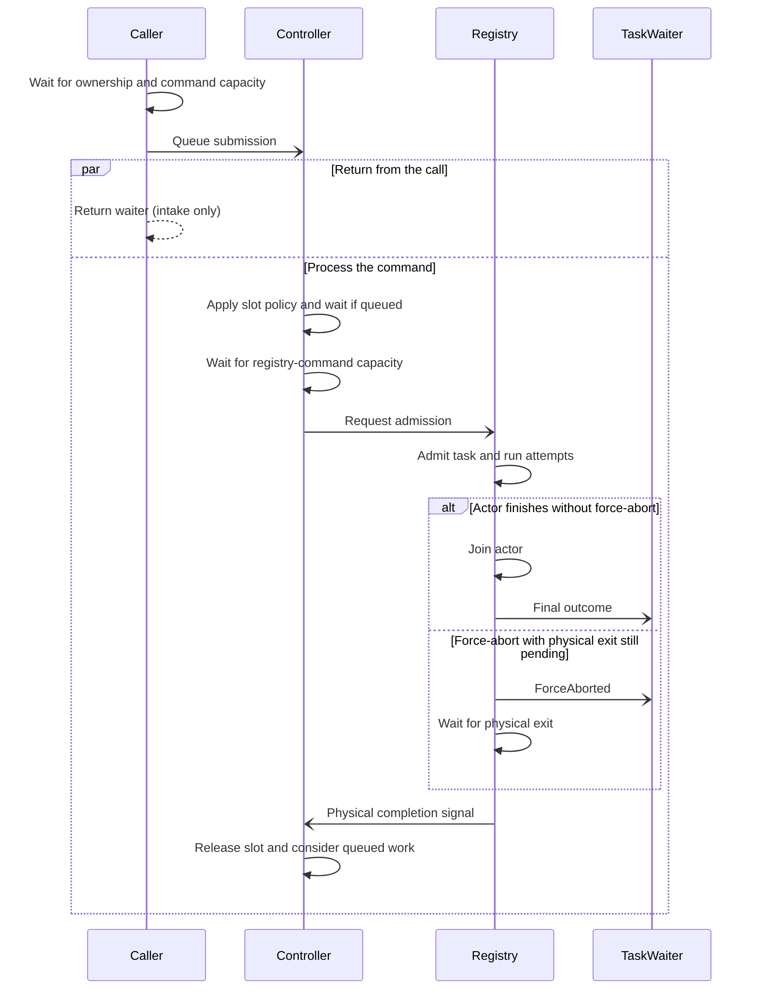

# Coordinate work by key

Use a controller when work that shares a key must take turns.
Each controller slot has at most one owner, including work still waiting for admission or physical completion.

## Enable the controller

This section requires the `controller` feature.
It is enabled by default, but each supervisor must install a controller explicitly:

```rust
use taskvisor::{ControllerConfig, Supervisor, SupervisorConfig};

let _supervisor = Supervisor::builder(SupervisorConfig::default())
    .with_controller(ControllerConfig::default())
    .build();
```

## Separate IDs, names, and slots

Direct `add` operations bypass controller admission.
`submit` accepts a [ControllerSpec](https://docs.rs/taskvisor/latest/taskvisor/controller/struct.ControllerSpec.html).
The controller applies its slot policy before asking the runtime registry to admit the task.

| Identity                                                                         | Scope                                                    |
|----------------------------------------------------------------------------------|----------------------------------------------------------|
| [TaskId](https://docs.rs/taskvisor/latest/taskvisor/identity/struct.TaskId.html) | One process-local registration or controller submission. |
| Task name                                                                        | Registry key inside one supervisor.                      |
| Controller slot                                                                  | Admission key inside one supervisor controller.          |

Different task names can share a slot.
Without [with_slot](https://docs.rs/taskvisor/latest/taskvisor/controller/struct.ControllerSpec.html#method.with_slot), the task name is also the slot.
A queued submission has an ID, but does not own a registered task name yet.

A busy slot may be waiting for admission, running work, or waiting for physical completion.
Busy does not always mean that a task body is currently polling.

## Choose a busy-slot policy

| Policy                                                                                                                   | Busy-slot behavior                                                                                                                                                                        |
|--------------------------------------------------------------------------------------------------------------------------|-------------------------------------------------------------------------------------------------------------------------------------------------------------------------------------------|
| [`Queue`](https://docs.rs/taskvisor/latest/taskvisor/controller/enum.AdmissionPolicy.html#variant.Queue)                 | Append to the bounded FIFO queue. A later [`Replace`](https://docs.rs/taskvisor/latest/taskvisor/controller/enum.AdmissionPolicy.html#variant.Replace) can still displace the queue head. |
| [`Replace`](https://docs.rs/taskvisor/latest/taskvisor/controller/enum.AdmissionPolicy.html#variant.Replace)             | Request the owner to stop; create or replace the queue head.                                                                                                                              |
| [`DropIfRunning`](https://docs.rs/taskvisor/latest/taskvisor/controller/enum.AdmissionPolicy.html#variant.DropIfRunning) | Reject the incoming submission without changing the owner or queue.                                                                                                                       |

A replacement is not guaranteed to become the next owner.
A newer [`Replace`](https://docs.rs/taskvisor/latest/taskvisor/controller/enum.AdmissionPolicy.html#variant.Replace) can displace it before admission. The registry can also reject it later.
[`Replace`](https://docs.rs/taskvisor/latest/taskvisor/controller/enum.AdmissionPolicy.html#variant.Replace) changes only the queue head and preserves the FIFO tail.
It does not use the per-slot [`max_slot_queue`](https://docs.rs/taskvisor/latest/taskvisor/controller/struct.ControllerConfig.html#method.max_slot_queue) limit, but creating a new head can still reach [`max_total_pending`](https://docs.rs/taskvisor/latest/taskvisor/controller/struct.ControllerConfig.html#method.max_total_pending).

```rust
use taskvisor::{ControllerSpec, TaskFn, TaskRef, TaskSpec};

let task: TaskRef = TaskFn::arc(|_ctx| async { Ok(()) });
let request = ControllerSpec::queue(TaskSpec::once("customer-42-job", task))
    .with_slot("customer-42");

assert_eq!(request.task_spec().name(), "customer-42-job");
assert_eq!(request.slot_name(), "customer-42");
```

## Watch admission and completion

[submit](https://docs.rs/taskvisor/latest/taskvisor/core/struct.SupervisorHandle.html#method.submit) creates an operation whose `execute()` confirms command intake only.
Its `watch()` modifier makes `execute()` return a waiter. Read the submission identity through `waiter.id()`.
The waiter resolves to [`Rejected`](https://docs.rs/taskvisor/latest/taskvisor/core/enum.TaskOutcome.html#variant.Rejected) if admission fails or to the registered task's final outcome if admission succeeds.

The call first waits for cleanup ownership and controller-command capacity.
After the command is queued, returning to the caller and processing the command can race.
The return from `submit(request).watch().execute()` is not an admission reply or proof that the task has started.

This diagram shows successful admission. Slot or registry rejection resolves the waiter to [`Rejected`](https://docs.rs/taskvisor/latest/taskvisor/core/enum.TaskOutcome.html#variant.Rejected) instead.



Each attempt waits for a concurrency permit if a limit is configured.
The slot becomes reusable only after the registered task physically completes and terminal reporting is done.
Deferred destruction of retained user values can continue after slot release.
See [task management](managing-tasks.md#choose-waiting-bounded-ownership-or-fail-fast-intake) for waiting and fail-fast calls.

This example starts an owner, rejects a competing [`DropIfRunning`](https://docs.rs/taskvisor/latest/taskvisor/controller/enum.AdmissionPolicy.html#variant.DropIfRunning) submission, and then stops the owner:

```rust
use std::sync::Arc;
use tokio::sync::Notify;
use taskvisor::prelude::*;

#[tokio::main(flavor = "current_thread")]
async fn main() -> Result<(), Box<dyn std::error::Error>> {
    let supervisor = Supervisor::builder(SupervisorConfig::default())
        .with_controller(ControllerConfig::default())
        .try_build()?;
    let handle = supervisor.serve()?;

    let owner_started = Arc::new(Notify::new());
    let owner: TaskRef = {
        let owner_started = Arc::clone(&owner_started);
        TaskFn::arc(move |ctx| {
            let owner_started = Arc::clone(&owner_started);
            async move {
                owner_started.notify_one();
                ctx.cancelled().await;
                Err(TaskError::Canceled)
            }
        })
    };

    let owner_request = ControllerSpec::queue(TaskSpec::once("tenant-42/owner", owner))
        .with_slot("tenant-42");
    let owner_waiter = handle.submit(owner_request).watch().execute().await?;
    let owner_id = owner_waiter.id();
    owner_started.notified().await;

    let contender: TaskRef = TaskFn::arc(|_ctx| async { Ok(()) });
    let contender_request = ControllerSpec::drop_if_running(TaskSpec::once(
        "tenant-42/contender",
        contender,
    ))
    .with_slot("tenant-42");
    let contender_waiter = handle
        .submit(contender_request)
        .watch()
        .execute()
        .await?;

    assert!(matches!(
        contender_waiter.wait().await?,
        TaskOutcome::Rejected {
            kind: RejectionKind::SlotBusy,
            ..
        }
    ));

    assert!(handle.cancel(owner_id).execute().await?);
    assert!(matches!(
        owner_waiter.wait().await?,
        TaskOutcome::Canceled
    ));

    handle.shutdown().await?;
    Ok(())
}
```

The notification proves that the first task has started before the contender is submitted.
That owner waits for cancellation and keeps the slot occupied.
The two waiters deliver the contender's rejection and the owner's final outcome directly.

[prepare_submission](https://docs.rs/taskvisor/latest/taskvisor/core/struct.SupervisorHandle.html#method.prepare_submission) allocates a task ID before intake.
It does not reserve a name, slot, queue position, or runtime capacity.

## Read diagnostic state

[controller_snapshot](https://docs.rs/taskvisor/latest/taskvisor/core/struct.SupervisorHandle.html#method.controller_snapshot) reads each slot separately.
Its [ControllerSnapshot](https://docs.rs/taskvisor/latest/taskvisor/controller/struct.ControllerSnapshot.html) can already be stale when returned.
Do not treat it as a transaction boundary.

## Know timeout and cancellation scope

Attempt timeout starts only after registry admission and after [`Task::spawn`](https://docs.rs/taskvisor/latest/taskvisor/tasks/trait.Task.html#tymethod.spawn) returns the attempt future.
It does not limit time spent in a controller queue. Controller submission has no built-in end-to-end deadline.

The `ownership_timeout(duration)` submission modifier limits only the wait for cleanup ownership before command intake.
The timer stops when Taskvisor acquires the ownership permit.
It does not cover controller-command capacity, a busy-slot queue, slot admission, registry-command capacity, task execution, or final outcome delivery.
The operation created by `PreparedSubmission::submit()` uses the same boundary.
A timeout consumes the prepared value, but produces no command or lifecycle event for its reserved ID.

Slots govern admission, not cancellation.
There is no slot-wide cancel or remove operation.
Stop queued work by task ID and registered work by task ID or task name.
Removing or canceling work that is still queued or waiting for registry-command capacity removes it before it runs.
Its waiter resolves to [`Rejected`](https://docs.rs/taskvisor/latest/taskvisor/core/enum.TaskOutcome.html#variant.Rejected) with [RejectionKind::RemovedFromQueue](https://docs.rs/taskvisor/latest/taskvisor/events/enum.RejectionKind.html#variant.RemovedFromQueue), not [`Canceled`](https://docs.rs/taskvisor/latest/taskvisor/core/enum.TaskOutcome.html#variant.Canceled).

## Bound controller resources

[ControllerConfig](https://docs.rs/taskvisor/latest/taskvisor/controller/struct.ControllerConfig.html) bounds separate stages:

| Setting                                                                                                                                                | What it bounds                                                | When full                                                                                                                                                                                                                                                                                                                                                  |
|--------------------------------------------------------------------------------------------------------------------------------------------------------|---------------------------------------------------------------|------------------------------------------------------------------------------------------------------------------------------------------------------------------------------------------------------------------------------------------------------------------------------------------------------------------------------------------------------------|
| [`queue_capacity`](https://docs.rs/taskvisor/latest/taskvisor/controller/struct.ControllerConfig.html#method.queue_capacity)                           | Ordered controller commands.                                  | `execute()` waits; `try_intake()` returns [`ControllerError::Full`](https://docs.rs/taskvisor/latest/taskvisor/controller/enum.ControllerError.html#variant.Full).                                                                                                                                                                                         |
| [`max_slot_queue`](https://docs.rs/taskvisor/latest/taskvisor/controller/struct.ControllerConfig.html#method.max_slot_queue)                           | Pending depth behind one owner, including a replacement head. | New [`Queue`](https://docs.rs/taskvisor/latest/taskvisor/controller/enum.AdmissionPolicy.html#variant.Queue) submissions get watched [`Rejected`](https://docs.rs/taskvisor/latest/taskvisor/core/enum.TaskOutcome.html#variant.Rejected) with [`QueueFull`](https://docs.rs/taskvisor/latest/taskvisor/events/enum.RejectionKind.html#variant.QueueFull). |
| [`max_total_pending`](https://docs.rs/taskvisor/latest/taskvisor/controller/struct.ControllerConfig.html#method.max_total_pending)                     | Slot queues and registry-capacity waits.                      | New pending entries get watched [`Rejected`](https://docs.rs/taskvisor/latest/taskvisor/core/enum.TaskOutcome.html#variant.Rejected) with [`ResourceLimit`](https://docs.rs/taskvisor/latest/taskvisor/events/enum.RejectionKind.html#variant.ResourceLimit).                                                                                              |
| [`max_controller_slots`](https://docs.rs/taskvisor/latest/taskvisor/controller/struct.ControllerConfig.html#method.max_controller_slots)               | Tracked slots.                                                | New slots get watched [`Rejected`](https://docs.rs/taskvisor/latest/taskvisor/core/enum.TaskOutcome.html#variant.Rejected) with [`ResourceLimit`](https://docs.rs/taskvisor/latest/taskvisor/events/enum.RejectionKind.html#variant.ResourceLimit).                                                                                                        |
| [`admission_capacity`](https://docs.rs/taskvisor/latest/taskvisor/controller/struct.ControllerConfig.html#method.admission_capacity)                   | Waits for registry-command capacity.                          | New waits get watched [`Rejected`](https://docs.rs/taskvisor/latest/taskvisor/core/enum.TaskOutcome.html#variant.Rejected) with [`ResourceLimit`](https://docs.rs/taskvisor/latest/taskvisor/events/enum.RejectionKind.html#variant.ResourceLimit).                                                                                                        |
| [`identity_operation_capacity`](https://docs.rs/taskvisor/latest/taskvisor/controller/struct.ControllerConfig.html#method.identity_operation_capacity) | Concurrent registry-backed ID remove/cancel operations.       | `execute().await` returns [`RuntimeError::ResourceLimitReached`](https://docs.rs/taskvisor/latest/taskvisor/error/enum.RuntimeError.html#variant.ResourceLimitReached).                                                                                                                                                                                    |

Queued controller removal happens before the identity-operation limit is checked.
Buffered controller commands and work already handed to the registry do not count toward [`max_total_pending`](https://docs.rs/taskvisor/latest/taskvisor/controller/struct.ControllerConfig.html#method.max_total_pending).
Replacing an existing queue head does not need another pending unit.
See the API reference for defaults and [configuration](configuration.md#bound-different-resources) for runtime and ownership limits.

Runnable controller examples:

- [controller_slots.rs](../examples/controller_slots.rs) compares all three policies;
- [controller_admission.rs](../examples/controller_admission.rs) watches admission and rejection;
- [tenant_sync.rs](../examples/tenant_sync.rs) keeps the newest waiting revision per tenant.

Source: [submission intake](../src/controller/engine/handle/submission.rs), [slot placement](../src/controller/engine/admission/placement.rs), [queue policies](../src/controller/engine/queue.rs), [slot lifecycle](../src/controller/engine/state/slot.rs), and [completion signals](../src/core/registry/completion.rs).
