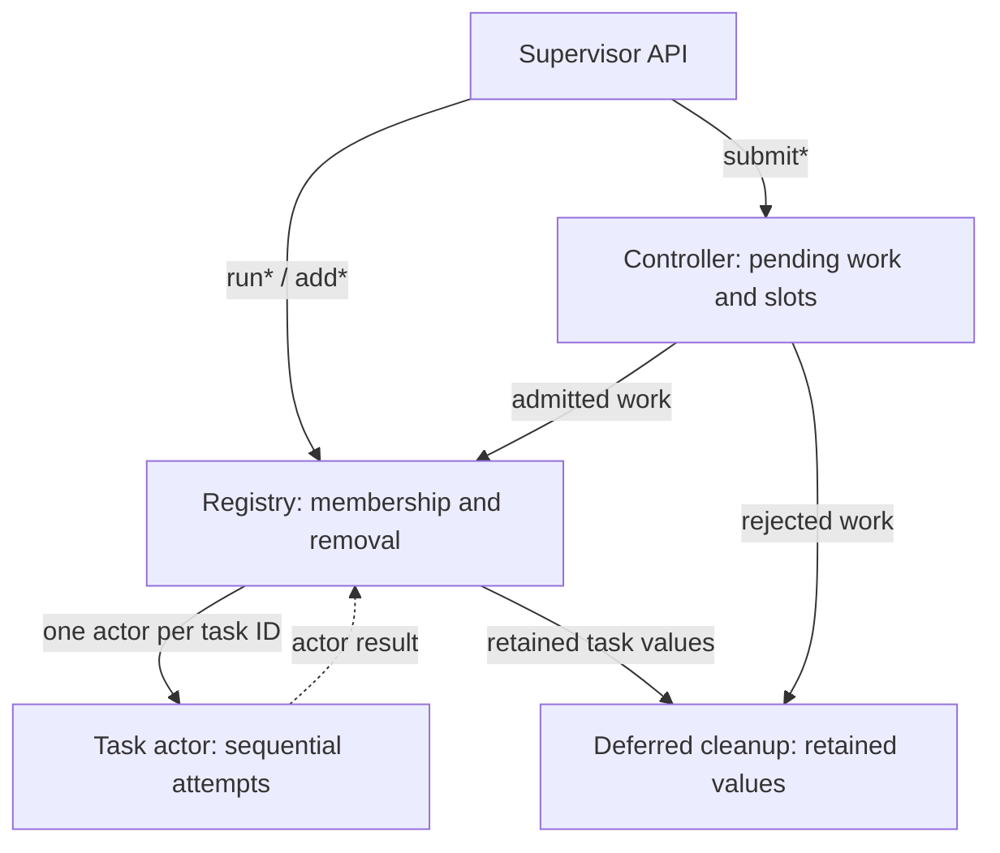

# Mental model

A [task](https://docs.rs/taskvisor/latest/taskvisor/tasks/trait.Task.html) creates a fresh future for each attempt.
A [task specification](https://docs.rs/taskvisor/latest/taskvisor/tasks/struct.TaskSpec.html) gives that work a name and lifecycle policy.
One registration has one task ID. Its attempts run one at a time.

## Choose how work enters

| Entry path                      | Use it for                                                      |
|---------------------------------|-----------------------------------------------------------------|
| `Supervisor::run*`              | A fixed batch or resident workers known at startup.             |
| `Supervisor::serve` + `add*`    | Work discovered or managed while the service is running.        |
| `Supervisor::serve` + `submit*` | Work that first needs per-key queue, replace, or reject policy. |

Static batches and direct adds enter the same registry.
Controller submissions apply slot admission first, then hand admitted work to that registry.
Direct adds do not use controller policy. See [Coordinate work by key](keyed-admission.md).

## Follow one registration through the runtime

The [registry](../src/core/registry/mod.rs) owns membership and task removal.
The [task actor](../src/core/actor.rs) owns retries and delays for one task ID.
The [attempt runner](../src/core/runner.rs) calls `Task::spawn`, applies the attempt timeout, and catches task panics.
For registry-admitted tasks, deferred cleanup receives retained values after the physical actor exits.
The diagram shows ownership boundaries, not the order of every cleanup step.

`TaskSpec::once`, `restartable`, and `periodic` choose [what happens after an attempt](lifecycle-policies.md).
They use the same runtime. Attempts for one task ID never overlap.
The [architecture map](../src/ARCHITECTURE.md) shows how these components connect.

## Know each identity and result path

| Value              | Role                                                                |
|--------------------|---------------------------------------------------------------------|
| `Task` or `TaskFn` | Creates a fresh future for each attempt.                            |
| `TaskSpec`         | Gives work its registry name and execution policy.                  |
| [`Supervisor`](https://docs.rs/taskvisor/latest/taskvisor/core/struct.Supervisor.html) | Owns one Taskvisor runtime. |
| [`SupervisorHandle`](https://docs.rs/taskvisor/latest/taskvisor/core/struct.SupervisorHandle.html) | Manages that shared runtime. |
| [`TaskId`](https://docs.rs/taskvisor/latest/taskvisor/identity/struct.TaskId.html) | Identifies one process-local registration or controller submission. |
| Task name          | Uniquely identifies registry membership inside one supervisor.      |
| Controller slot    | Coordinates submissions that must not own the same key together.    |
| [`TaskWaiter`](https://docs.rs/taskvisor/latest/taskvisor/core/struct.TaskWaiter.html) | Delivers one direct in-process final outcome. |
| [`Event`](https://docs.rs/taskvisor/latest/taskvisor/events/struct.Event.html) | Describes lifecycle activity through best-effort delivery. |

A task ID does not prove that work was admitted or started.
A task name is the registry uniqueness key. A controller slot is the key for queue, replace, or reject policy.

## Separate command, result, and observation paths

- A [management method](managing-tasks.md#choose-an-operation) reports whether its own operation reached the documented boundary.
- A `TaskWaiter` reports how one watched task or submission finally ended.
- Events report lifecycle activity for logs, traces, metrics, and diagnostics.
- `list`, `alive_snapshot`, `ownership_snapshot`, and `controller_snapshot` report different point-in-time runtime views.

Registry cleanup sends the watched task outcome. A controller can also send a watched rejection before the task runs.
An accepted command is not a final task result.
An event is not a reliable command reply. [Outcomes and events](outcomes-and-events.md) use separate delivery paths.

## Separate logical outcome from physical release

A final outcome ends the watched logical lifecycle.
It does not always mean that every synchronous poll, callback, or user-value destructor has finished.
`ForceAborted` can arrive before the physical attempt exits.
[Deferred cleanup](../src/core/deferred_drop/mod.rs) can retain user values after registry membership ends.
Read [Cancellation and shutdown](cancellation-and-shutdown.md#separate-logical-completion-from-physical-release) for these stages and [Production boundaries](production-boundaries.md) for their limits.
