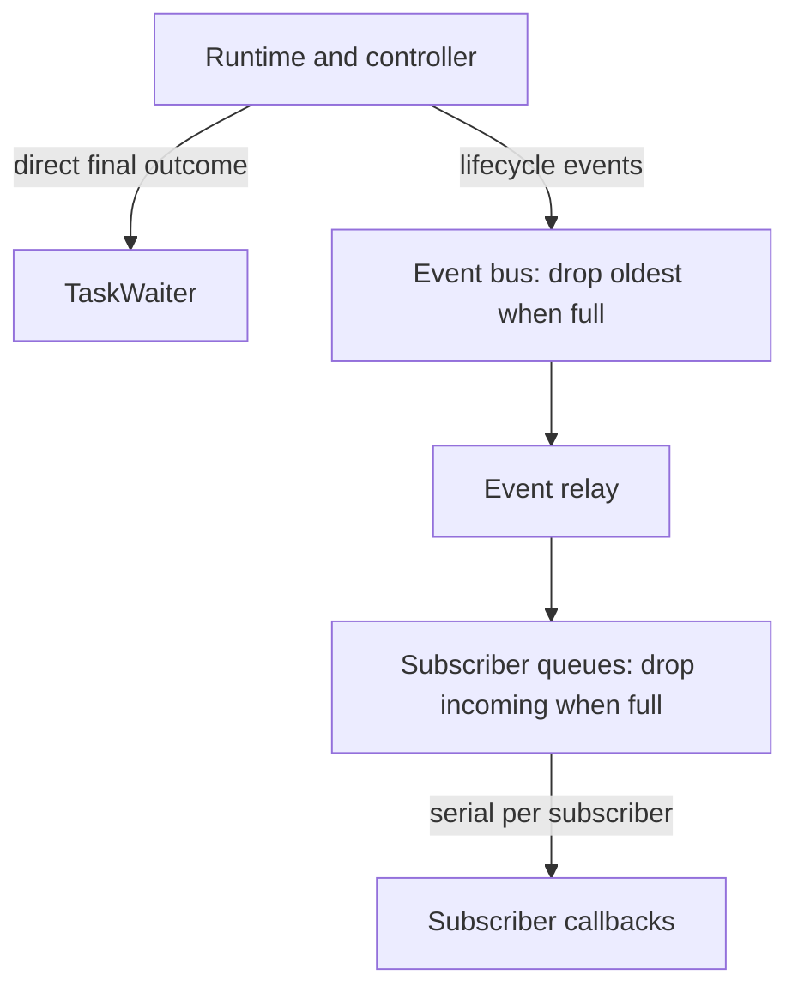
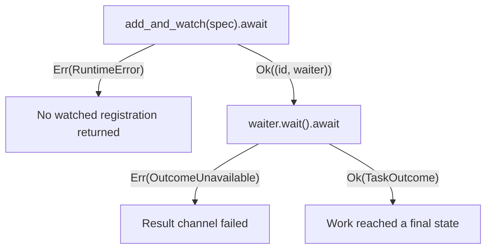

# Final outcomes and lifecycle events

## Choose the result path

Taskvisor has two result paths with different contracts:

| Path                           | Contract                                        | Use it for                              |
|--------------------------------|-------------------------------------------------|-----------------------------------------|
| [TaskWaiter](https://docs.rs/taskvisor/latest/taskvisor/core/struct.TaskWaiter.html) and [TaskOutcome](https://docs.rs/taskvisor/latest/taskvisor/core/enum.TaskOutcome.html) | One direct final result, outside the event bus. | Application decisions. |
| [Subscribe](https://docs.rs/taskvisor/latest/taskvisor/subscribers/trait.Subscribe.html) and [Event](https://docs.rs/taskvisor/latest/taskvisor/events/struct.Event.html) | Best-effort bounded delivery. | Logs, metrics, traces, and live status. |

A watched outcome is independent of event loss while the process and runtime remain alive.
It is not durable storage.
[TaskWaiter::wait](https://docs.rs/taskvisor/latest/taskvisor/core/struct.TaskWaiter.html#method.wait) can return `OutcomeUnavailable` if its completion channel closes unexpectedly.
Dropping the waiter does not cancel the task.



The event path has two separate loss points. Neither controls the direct outcome channel.

## Separate API errors from task outcomes

An API error means the call did not return its documented success value.
It does not prove that no command or state change was committed. Check the contract of that method.
A `TaskOutcome` reports how watched work finally ended.



| Boundary                                                              | Type              |
|-----------------------------------------------------------------------|-------------------|
| Checked configuration constructors and setters | [ConfigError](https://docs.rs/taskvisor/latest/taskvisor/core/enum.ConfigError.html) |
| `BackoffPolicy::new` | [BackoffError](https://docs.rs/taskvisor/latest/taskvisor/policies/enum.BackoffError.html) |
| `SupervisorBuilder::try_build` | [BuildError](https://docs.rs/taskvisor/latest/taskvisor/error/enum.BuildError.html) |
| Runtime lifecycle, management, wait, and shutdown | [RuntimeError](https://docs.rs/taskvisor/latest/taskvisor/error/enum.RuntimeError.html) |
| Controller preparation and command intake | [ControllerError](https://docs.rs/taskvisor/latest/taskvisor/controller/enum.ControllerError.html) |
| One task attempt | [TaskError](https://docs.rs/taskvisor/latest/taskvisor/error/enum.TaskError.html) |
| Final result of watched work | `TaskOutcome` |
| Application code that combines runtime and controller calls | [Error](https://docs.rs/taskvisor/latest/taskvisor/error/enum.Error.html) |

`SupervisorBuilder::build` and `Supervisor::new` panic when checked construction would fail.
Use [try_build](https://docs.rs/taskvisor/latest/taskvisor/core/struct.SupervisorBuilder.html#method.try_build) to handle typed construction errors.

`Ok(TaskOutcome::Failed { .. })` means outcome delivery succeeded and the task ended in failure.
It is not an API error.
For controller work, `submit_and_watch().await?` confirms command intake.
The waiter can later deliver `TaskOutcome::Rejected` if slot or registry admission fails.

## Handle final outcomes

Final outcomes distinguish:

| Outcome        | Meaning                                                                                 |
|----------------|-----------------------------------------------------------------------------------------|
| `Completed`    | The final attempt succeeded and the restart policy stopped the task.                    |
| `Failed`       | Retryable failure stopped under policy or retry limit.                                  |
| `Fatal`        | The task reported a permanent failure.                                                  |
| `Canceled`     | Cancellation was requested or reported.                                                 |
| `ForceAborted` | Taskvisor stopped waiting before the task stopped cooperatively. |
| `Panicked` | The actor or protected attempt-owned cleanup panicked before final outcome delivery. |
| `Rejected`     | Admission rejected the work, or queued controller work was removed.                     |

Use [TaskOutcomeKind](https://docs.rs/taskvisor/latest/taskvisor/core/enum.TaskOutcomeKind.html) and [RejectionKind](https://docs.rs/taskvisor/latest/taskvisor/events/enum.RejectionKind.html) for branching, metrics, and alerts.
Treat reason strings as diagnostic text.
A panic while polling task code becomes a retryable task failure instead of `Panicked`.
Removing watched controller work while it is still queued or waiting for registry-command capacity produces `Rejected` with `RejectionKind::RemovedFromQueue`, not `Canceled`.
Once work enters the registry, cancellation uses the normal task lifecycle even if the task is still waiting for a concurrency permit.

Taskvisor delivers the final outcome before deferred cleanup destroys the retained task object and actor result.
That later destruction can block or panic. It cannot change an outcome already delivered through `TaskWaiter`.
Failures on that later path are reported as best-effort runtime diagnostics, not a new `TaskOutcome::Panicked`.

## Branch on a final outcome

Match typed variants for application decisions and use stable labels for telemetry.
Keep a fallback arm because `TaskOutcome` is non-exhaustive.

```rust
use taskvisor::{TaskOutcome, TaskWaiter};

async fn report(waiter: TaskWaiter) -> Result<(), Box<dyn std::error::Error>> {
    let outcome = waiter.wait().await?;

    match &outcome {
        TaskOutcome::Completed => println!("completed"),
        TaskOutcome::Failed { reason, .. } => println!("failed: {reason}"),
        TaskOutcome::Fatal { reason, .. } => println!("fatal: {reason}"),
        TaskOutcome::Rejected { kind, .. } => println!("rejected: {kind:?}"),
        other => println!("ended: {}", other.as_label()),
    }

    Ok(())
}
```

Use [TaskOutcome::kind](https://docs.rs/taskvisor/latest/taskvisor/core/enum.TaskOutcome.html#method.kind) or typed variants for classification, not reason strings.

## Understand ForceAborted

[ForceAborted](https://docs.rs/taskvisor/latest/taskvisor/core/enum.TaskOutcome.html#variant.ForceAborted) normally follows the configured grace period.
Last-owner fallback and signal-setup failure cleanup cannot wait for that period.
The physical attempt can remain active until synchronous task code returns control to Tokio.

## Treat events as observability

Choose the interface for the question:

| Need                                  | Interface                                      |
|---------------------------------------|------------------------------------------------|
| Application decision                  | `TaskWaiter` and `TaskOutcome`                 |
| Readable demo or small-tool logs | [LogWriter](https://docs.rs/taskvisor/latest/taskvisor/subscribers/struct.LogWriter.html) with `logging`. |
| Structured service telemetry | [TracingBridge](https://docs.rs/taskvisor/latest/taskvisor/subscribers/struct.TracingBridge.html) with `tracing`. |
| Application-owned metrics             | A custom `Subscribe` implementation            |
| Registry membership | [list](https://docs.rs/taskvisor/latest/taskvisor/core/struct.SupervisorHandle.html#method.list) |
| Physical attempt activity | [alive_snapshot](https://docs.rs/taskvisor/latest/taskvisor/core/struct.SupervisorHandle.html#method.alive_snapshot) |
| Retained values and cleanup pressure | [ownership_snapshot](https://docs.rs/taskvisor/latest/taskvisor/core/struct.SupervisorHandle.html#method.ownership_snapshot) |
| Per-key admission state | [controller_snapshot](https://docs.rs/taskvisor/latest/taskvisor/core/struct.SupervisorHandle.html#method.controller_snapshot) |

The shared event bus and every subscriber queue are bounded.
Events can be lost at the shared bus or in an individual subscriber queue.
When the shared bus is full, it drops the oldest event and retains the newest one.
When one subscriber queue is full, Taskvisor drops the incoming event for that subscriber.
Callbacks run one at a time for each subscriber. Different subscribers can run at the same time.

Subscriber callbacks are synchronous and run outside Tokio worker threads. Keep them short.
Forward async or long blocking work to an application-owned queue.
Retiring callback threads keep their worker slots until their thread-local destructors finish.
Slow thread-local destruction reduces available callback capacity until it returns.
Taskvisor waits for these threads in a separate bounded OS thread pool, outside Tokio and its blocking pool.
Shutdown does not wait for thread-local destruction.
Shutdown deadlines can also drop events.
[SubscriberOverflow](https://docs.rs/taskvisor/latest/taskvisor/events/enum.EventKind.html#variant.SubscriberOverflow) diagnostics report loss when possible.

## Correlate events

Match `Event.kind` before reading its optional fields.
The [Event API](https://docs.rs/taskvisor/latest/taskvisor/events/struct.Event.html) and [EventKind API](https://docs.rs/taskvisor/latest/taskvisor/events/enum.EventKind.html) list the fields for each event:

| Field | Meaning |
|-------|---------|
| `id` | The task or submission ID, when present. Use it to correlate one submission across controller and runtime events. |
| `task` | The event's subject: usually a task name, but a slot name for controller events. Diagnostics may use a subscriber or runtime component name. |
| `outcome_kind`, `rejection_kind` | Typed final-outcome or rejection categories. Use their stable labels for telemetry. |
| `seq` | Process-local construction order, not the order of concurrent effects. It does not survive a process restart. |

Do not treat `task` as a task ID or parse `reason` as a stable category.
The [metrics example](../examples/metrics.rs) uses a `subject` label for `task` and explains how to keep labels bounded.

See [outcomes.rs](../examples/outcomes.rs), [custom_subscriber.rs](../examples/custom_subscriber.rs), [logging.rs](../examples/logging.rs) (requires `logging`), [tracing.rs](../examples/tracing.rs) (requires `tracing`), and [metrics.rs](../examples/metrics.rs).

Source: [final outcomes](../src/core/outcome.rs), [event fields](../src/events/event.rs), [event bus](../src/events/bus.rs), [event relay](../src/core/runtime/event_relay.rs), and [subscriber delivery](../src/subscribers/subscriber_set.rs).
