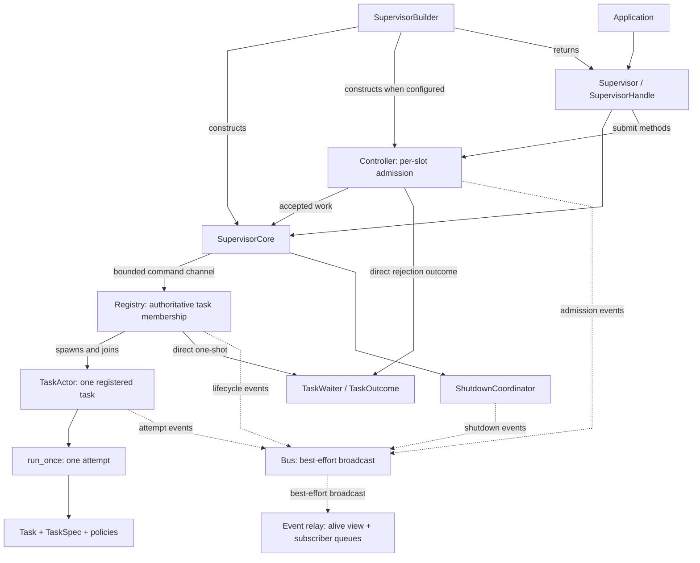
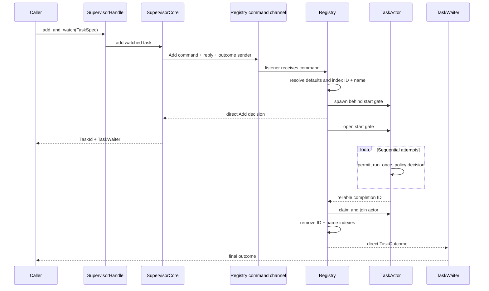
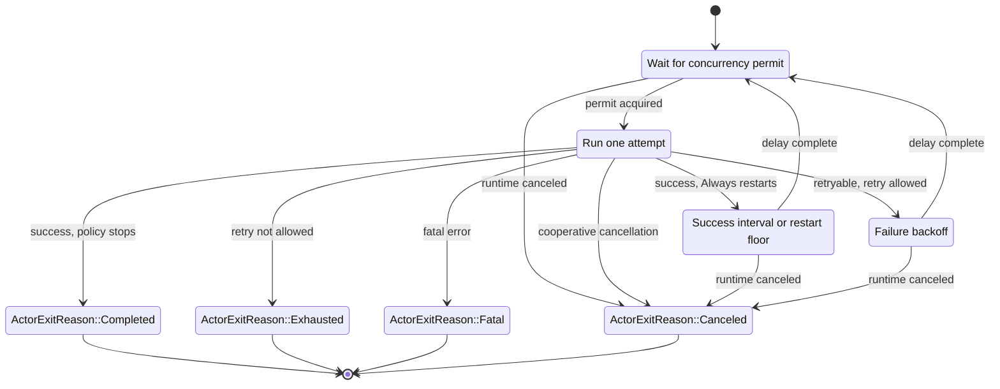
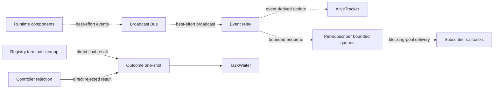
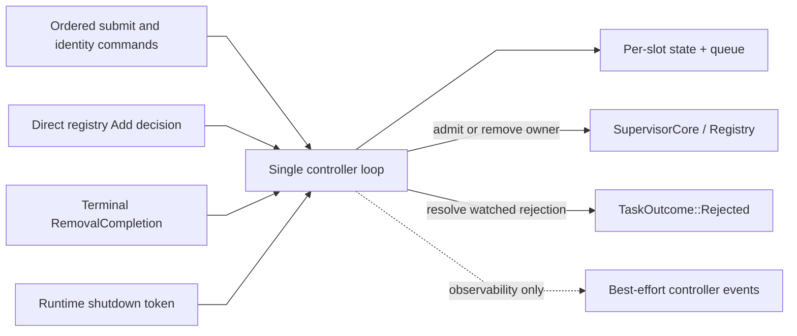
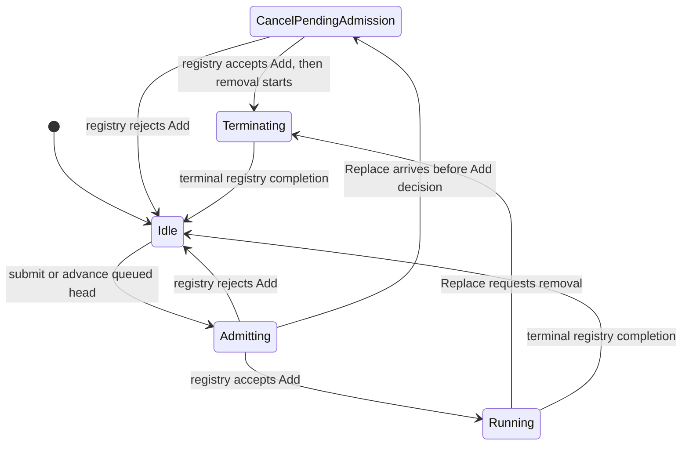
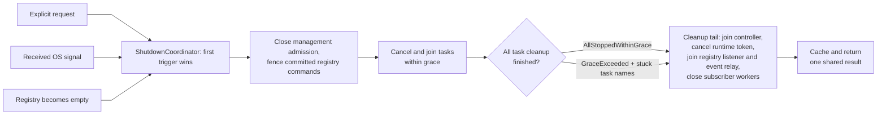

# Taskvisor source guide

This document is a reading map for contributors. 

It shows which module owns each decision and how data moves through the runtime. The Rust source and its module-level documentation remain the source of truth.

## Recommended reading order

Read the code in this order if you are new to the repository:

| Step | Files                                                                                                                                                                          | Question answered                                               |
|------|--------------------------------------------------------------------------------------------------------------------------------------------------------------------------------|-----------------------------------------------------------------|
| 1    | [`lib.rs`](lib.rs), [`prelude.rs`](prelude.rs)                                                                                                                                 | What is public                                                  |
| 2    | [`tasks/`](tasks), [`policies/`](policies), [`core/task_defaults.rs`](core/task_defaults.rs)                                                                                   | What describes a task and its retry rules                       |
| 3    | [`core/builder.rs`](core/builder.rs), [`core/supervisor.rs`](core/supervisor.rs), [`core/handle.rs`](core/handle.rs), [`core/owner.rs`](core/owner.rs)                         | How is the runtime built, owned, and exposed                    |
| 4    | [`core/runtime.rs`](core/runtime.rs), [`core/runtime/management.rs`](core/runtime/management.rs), [`core/runtime/lifecycle.rs`](core/runtime/lifecycle.rs)                     | How do public calls enter the runtime                           |
| 5    | [`core/registry.rs`](core/registry.rs), [`core/registry/`](core/registry)                                                                                                      | Which task state is authoritative, and how is it cleaned up     |
| 6    | [`core/actor.rs`](core/actor.rs), [`core/runner.rs`](core/runner.rs)                                                                                                           | How does one task run, retry, time out, and stop                |
| 7    | [`core/outcome.rs`](core/outcome.rs), [`events/`](events), [`subscribers/`](subscribers)                                                                                       | Which results are reliable, and which signals are observability |
| 8    | [`controller/mod.rs`](controller/mod.rs), [`controller/slot.rs`](controller/slot.rs), [`controller/core/`](controller/core)                                                    | How does per-slot queue/replace/reject admission work           |
| 9    | [`core/runtime/shutdown_workflow.rs`](core/runtime/shutdown_workflow.rs), [`core/shutdown.rs`](core/shutdown.rs), [`controller/core/shutdown.rs`](controller/core/shutdown.rs) | How is one shared shutdown coordinated                          |

After the module documentation, read the integration tests by behavior: [`tests/watch.rs`](../tests/watch.rs), [`tests/identity.rs`](../tests/identity.rs), [`tests/controller.rs`](../tests/controller.rs), and [`tests/shutdown.rs`](../tests/shutdown.rs).

## Runtime map

`SupervisorBuilder` wires the runtime but does not start its background tasks. 

`Supervisor::run` and `Supervisor::serve` call the idempotent runtime start path.

The controller is compiled by the default `controller` feature, but it is a runtime opt-in: it exists only when a builder receives a `ControllerConfig`. Direct `add*` methods bypass slot admission; `submit*` methods use it.

## Direct task lifecycle

The registry, not the event stream, owns task identity and cleanup. A watched add uses direct replies in both directions: one reply for admission and one final outcome after the actor join and membership removal.

For a static `run(tasks)` batch, the registry indexes every accepted entry, attempts all `TaskAdded` publications, and attempts the direct batch reply before one shared start gate releases any task body.

## One actor and its attempts

`run_once` owns one attempt: task invocation, panic capture, the attempt timeout, and the attempt terminal event. 

`TaskActor` owns the surrounding loop: the concurrency permit, restart policy, backoff, retry budget, and cancellation between attempts.

Important boundaries:

- Attempt numbers start at `1`.
- `max_retries` counts retries after the first failed attempt, not total attempts.
- A success resets the failure retry counter.
- A concurrency permit is held only while `run_once` is active.
- Task panics caught by `run_once` become retryable `TaskError::Fail` values.
- The actor returns an internal `ActorExitReason`; the registry maps it to `TaskOutcome` after joining the actor and removing its ID and name indexes.
- Force-abort and an outer Tokio join failure are cleanup results, not normal actor exits.

## Events and reliable outcomes are separate paths

Events support diagnostics, metrics, and best-effort liveness views. They do not drive cleanup, watched outcomes, or controller slot ownership.

Use the following source according to the question being asked:

| Question | Source |
|----------|--------|
| Is a task still registered or being removed? | `SupervisorHandle::list`, backed by the registry |
| What final result did this watched task produce? | `TaskWaiter`, backed by a direct one-shot |
| What happened for logging or metrics? | Events and subscribers |
| Which tasks look alive from observed lifecycle events? | `alive_snapshot` / `is_alive`; these views may lag |
| What is the current controller view? | `controller_snapshot`; it is a rolling diagnostic snapshot, not a transaction |

"Reliable" here means that a watched result does not depend on the lossy event path. It does not add persistence across process termination.

## Controller admission

The controller is a serialized admission layer before the registry. One loop owns slot transitions and processes ordered commands, direct registry Add decisions, terminal `RemovalCompletion` signals, and the reliable runtime shutdown token.

The internal slot phases are:

Policy behavior around those phases:

- `Queue` appends work in FIFO order until `ControllerConfig::max_slot_queue` is reached.
- `Replace` replaces the queued head and rejects the displaced head as `SupersededByReplace`. Existing FIFO work behind the head remains queued.
- `DropIfRunning` rejects new work while the slot has an owner.
- A successful removal request does not free the slot. Only terminal `RemovalCompletion`, after the registry has joined the actor and removed both identity indexes, frees it.
- A task name and a controller slot are different keys. The registry still enforces global task-name uniqueness.

## Shared shutdown

Explicit shutdown, a received OS signal, and natural completion join one cancellation-safe shutdown operation. The first trigger installs the operation; all callers wait for its cached result.

Subscriber shutdown has its own timeout and happens after the task grace phase. Every common cleanup phase is attempted even if an earlier phase reports an internal failure. If OS signal setup itself fails, shutdown still closes admission and runs the common cleanup tail, but it does not run the normal task-drain branch. Dropping the last runtime owner is only a synchronous fallback: it closes admission and cancels tokens, but cannot await or report graceful cleanup.

## Where to make a change

| Change                                                      | Start here                                                                                                                                                                                     | Verify here                                                                                                                           |
|-------------------------------------------------------------|------------------------------------------------------------------------------------------------------------------------------------------------------------------------------------------------|---------------------------------------------------------------------------------------------------------------------------------------|
| Public task contract or task configuration                  | [`tasks/`](tasks), [`core/task_defaults.rs`](core/task_defaults.rs)                                                                                                                            | [`tests/defaults.rs`](../tests/defaults.rs), rustdoc examples                                                                         |
| Attempt timeout, panic, or terminal event                   | [`core/runner.rs`](core/runner.rs)                                                                                                                                                             | unit tests in that module, [`tests/timeout.rs`](../tests/timeout.rs), [`tests/failure.rs`](../tests/failure.rs)                       |
| Restart, retry, backoff, or cancellation between attempts   | [`core/actor.rs`](core/actor.rs), [`policies/`](policies)                                                                                                                                      | actor unit tests, [`tests/failure.rs`](../tests/failure.rs), [`tests/lifecycle.rs`](../tests/lifecycle.rs)                            |
| Task identity, duplicate names, add/remove/cancel semantics | [`core/registry/`](core/registry), [`core/runtime/management.rs`](core/runtime/management.rs)                                                                                                  | [`tests/identity.rs`](../tests/identity.rs), [`tests/watch.rs`](../tests/watch.rs), [`tests/concurrency.rs`](../tests/concurrency.rs) |
| Final watched outcomes                                      | [`core/outcome.rs`](core/outcome.rs), [`core/registry/removal.rs`](core/registry/removal.rs)                                                                                                   | [`tests/watch.rs`](../tests/watch.rs)                                                                                                 |
| Event fields or delivery                                    | [`events/`](events), [`core/runtime/event_relay.rs`](core/runtime/event_relay.rs), [`subscribers/`](subscribers)                                                                               | [`tests/lifecycle.rs`](../tests/lifecycle.rs), subscriber unit tests                                                                  |
| Per-slot queue/replace/reject behavior                      | [`controller/slot.rs`](controller/slot.rs), [`controller/core/admission.rs`](controller/core/admission.rs), [`controller/core/queue.rs`](controller/core/queue.rs)                             | [`tests/controller.rs`](../tests/controller.rs), controller unit tests                                                                |
| Shutdown order or grace behavior                            | [`core/runtime/shutdown_workflow.rs`](core/runtime/shutdown_workflow.rs), [`core/registry/removal.rs`](core/registry/removal.rs), [`controller/core/shutdown.rs`](controller/core/shutdown.rs) | [`tests/shutdown.rs`](../tests/shutdown.rs), [`tests/ownership.rs`](../tests/ownership.rs)                                            |
| User-facing story                                           | [`../README.md`](../README.md), [`../examples/`](../examples), [`lib.rs`](lib.rs)                                                                                                              | `cargo test --all-features`, `cargo test --doc --all-features`                                                                        |

## Invariants to preserve

Before changing a coordination path, check these constraints in the owning module and its tests:

1. Registry membership is authoritative; events never add or remove membership.
2. Task ID and name indexes change under the same registry state lock.
3. A name stays reserved until terminal join cleanup removes it.
4. Exactly one cleanup owner claims and joins each actor handle.
5. Accepted task bodies start only after indexing and the admission publication/reply attempts.
6. Watched outcomes resolve outside the best-effort event path, after the actor join and registry membership removal.
7. The serialized controller loop owns slot transitions; queued work starts only after the current Add is rejected or the current owner reaches terminal removal completion.
8. Management admission closes and committed commands are fenced before shutdown drains tasks.
9. Concurrent shutdown callers join the same operation and receive its cached result.

When a change crosses one of these boundaries, update both the module-level documentation and the relevant diagram in this guide.
