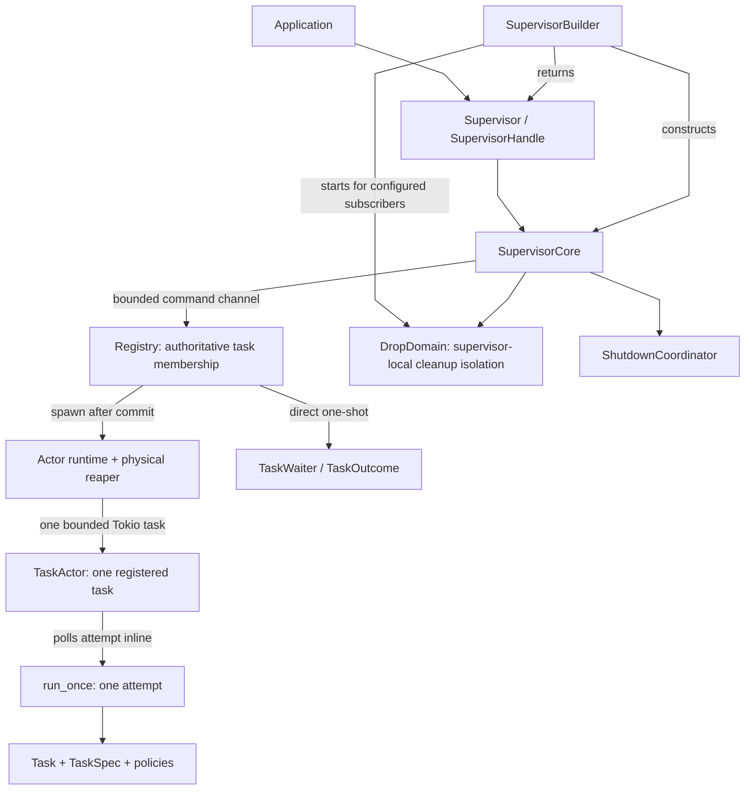
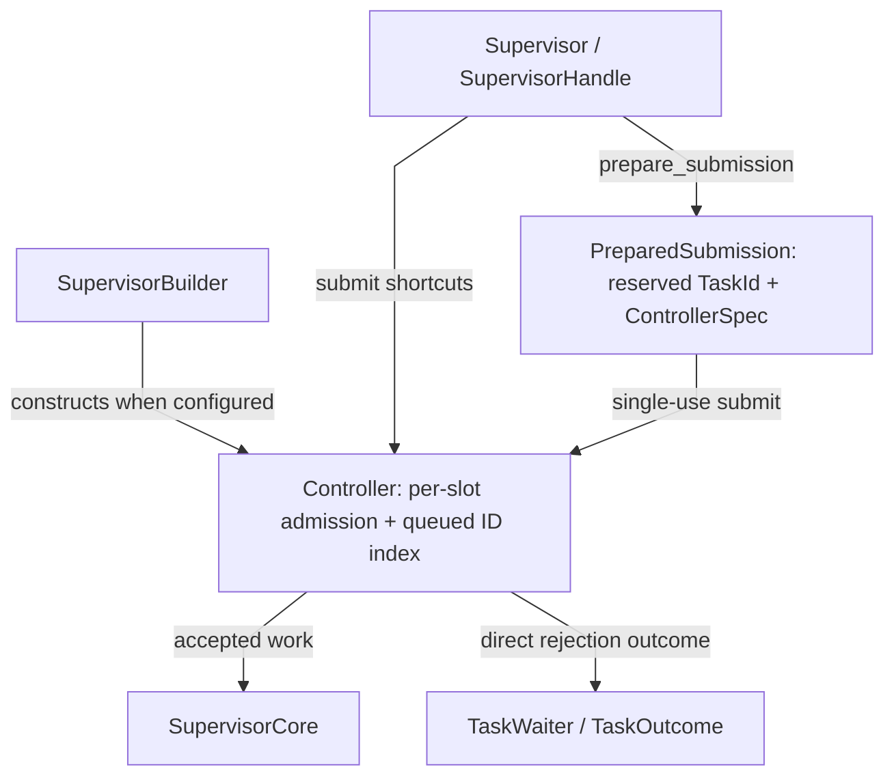
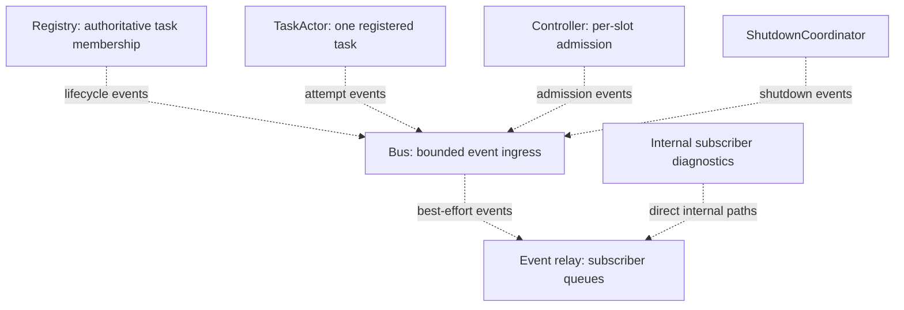
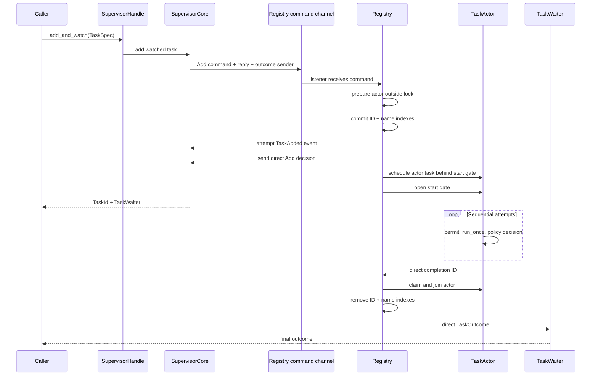
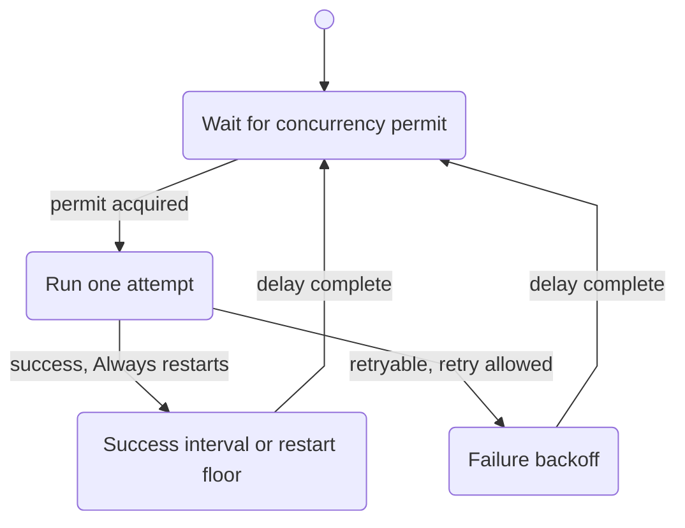
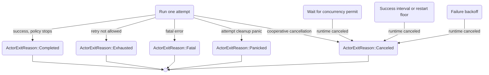
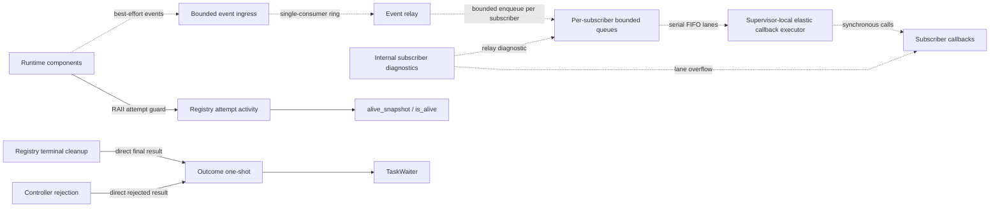
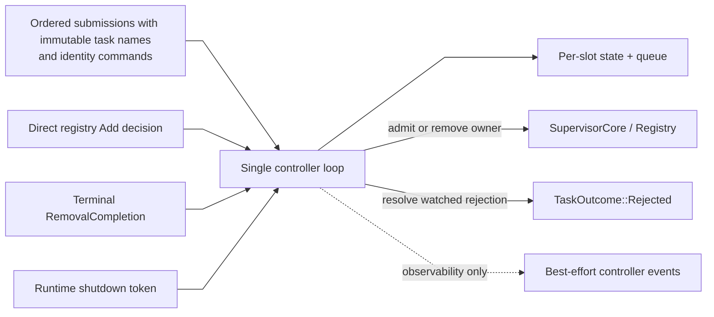
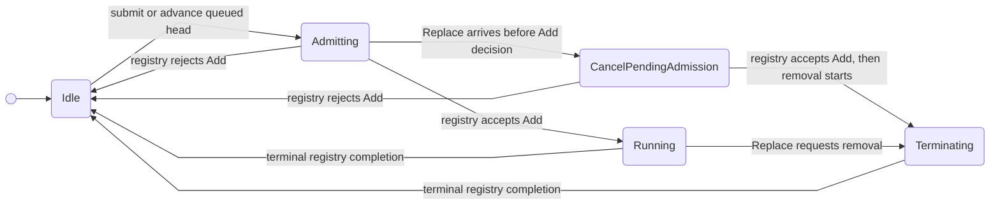
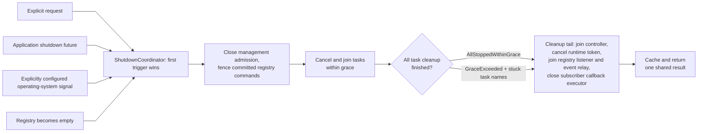

# Taskvisor source guide

This document is a reading map for contributors and reviewers. If you want to
use Taskvisor in an application, start with the
[crate documentation](https://docs.rs/taskvisor), the [README](../README.md),
and the [examples](../examples).

This guide shows which module owns each decision and how data moves through the
runtime. The Rust source and its module-level documentation remain the source
of truth.

## Architectural anchors

Keep these boundaries in mind while reading the implementation:

- The registry owns authoritative registered-task membership and terminal
  cleanup. The controller owns pending submissions before registry hand-off.
- One registry-accepted `TaskId` has one actor. Its attempts never overlap.
- Events are best-effort observability. A watched task outcome uses a separate
  direct one-shot.
- The controller makes per-slot admission decisions before registry admission.
  A controller slot and a task name are different keys.
- Shutdown is one shared operation. Logical force-abort does not prove physical
  task exit.

## Recommended reading order

Read the code in this order if you are new to the repository:

| Step | Files                                                                                                                                                                           | Question answered                                               |
|------|---------------------------------------------------------------------------------------------------------------------------------------------------------------------------------|-----------------------------------------------------------------|
| 1    | [`lib.rs`](lib.rs), [`prelude.rs`](prelude.rs)                                                                                                                                  | What is public                                                  |
| 2    | [`tasks/`](tasks), [`policies/`](policies), [`core/task_defaults.rs`](core/task_defaults.rs)                                                                                    | What describes a task and its retry rules                       |
| 3    | [`core/builder.rs`](core/builder.rs), [`core/supervisor.rs`](core/supervisor.rs), [`core/handle.rs`](core/handle.rs), [`core/owner.rs`](core/owner.rs)                          | How is the runtime built, owned, and exposed                    |
| 4    | [`core/runtime/mod.rs`](core/runtime/mod.rs), [`core/runtime/management/`](core/runtime/management), [`core/runtime/lifecycle/`](core/runtime/lifecycle)                       | How do public calls enter the runtime                           |
| 5    | [`core/registry/`](core/registry)                                                                                                                                                 | Which task state is authoritative, and how is it cleaned up     |
| 6    | [`core/actor.rs`](core/actor.rs), [`core/runner.rs`](core/runner.rs)                                                                                                            | How does one task run, retry, time out, and stop                |
| 7    | [`core/outcome.rs`](core/outcome.rs), [`events/`](events), [`subscribers/`](subscribers)                                                                                        | Which results use direct delivery, and which are observability   |
| 8    | [`controller/mod.rs`](controller/mod.rs), [`controller/prepared.rs`](controller/prepared.rs), [`controller/engine/state/slot.rs`](controller/engine/state/slot.rs), [`controller/engine/`](controller/engine) | How does per-slot queue/replace/reject admission work           |
| 9    | [`core/runtime/shutdown_workflow/`](core/runtime/shutdown_workflow), [`core/shutdown.rs`](core/shutdown.rs), [`controller/engine/lifecycle/shutdown.rs`](controller/engine/lifecycle/shutdown.rs) | How is one shared shutdown coordinated                          |

After the module documentation, read the integration tests by behavior: [`tests/watch.rs`](../tests/watch.rs), [`tests/identity.rs`](../tests/identity.rs), [`tests/controller.rs`](../tests/controller.rs), and [`tests/shutdown.rs`](../tests/shutdown.rs).

## Runtime map

`SupervisorBuilder` wires the runtime and constructs its supervisor-local
destructor-isolation domain. A configured subscriber set starts that domain
transactionally during construction; without subscribers it remains dormant.
The builder does not start Tokio tasks or subscriber callbacks.

`Supervisor::run` and `Supervisor::serve` call the fallible, idempotent runtime
start path.

The same component may appear in more than one path below. Repetition is only
for layout; each label refers to the same runtime component.

### Construction and task execution

```mermaid
%%{init: {"flowchart": {"curve": "linear"}}}%%
flowchart TB
    App["Application"]
    Builder["SupervisorBuilder"]
    Supervisor["Supervisor / SupervisorHandle"]
    Core["SupervisorCore"]
    Registry["Registry: authoritative task membership"]
    DropDomain["DropDomain: supervisor-local cleanup isolation"]
    Actors["Actor runtime + physical reaper"]
    Actor["TaskActor: one registered task"]
    Runner["run_once: one attempt"]
    Task["Task + TaskSpec + policies"]
    Shutdown["ShutdownCoordinator"]
    Waiter["TaskWaiter / TaskOutcome"]

    App --> Supervisor
    Builder -->|returns| Supervisor
    Supervisor --> Core
    Builder -->|constructs| Core
    Builder -->|starts for configured subscribers| DropDomain
    Core --> DropDomain
    Core -->|bounded command channel| Registry
    Registry -->|spawn after commit| Actors
    Actors -->|one bounded Tokio task| Actor
    Actor -->|polls attempt inline| Runner
    Runner --> Task
    Core --> Shutdown
    Registry -->|direct one-shot| Waiter
```

### Controller admission

```mermaid
%%{init: {"flowchart": {"curve": "linear"}}}%%
flowchart TB
    Builder["SupervisorBuilder"]
    Supervisor["Supervisor / SupervisorHandle"]
    Prepared["PreparedSubmission: reserved TaskId + ControllerSpec"]
    Controller["Controller: per-slot admission + queued ID index"]
    Core["SupervisorCore"]
    Waiter["TaskWaiter / TaskOutcome"]

    Builder -->|constructs when configured| Controller
    Supervisor -->|prepare_submission| Prepared
    Supervisor -->|submit shortcuts| Controller
    Prepared -->|single-use submit| Controller
    Controller -->|accepted work| Core
    Controller -->|direct rejection outcome| Waiter
```

### Best-effort observability

```mermaid
%%{init: {"flowchart": {"curve": "linear"}}}%%
flowchart TB
    Registry["Registry: authoritative task membership"]
    Actor["TaskActor: one registered task"]
    Controller["Controller: per-slot admission"]
    Shutdown["ShutdownCoordinator"]
    Bus["Bus: bounded event ingress"]
    Observability["Event relay: subscriber queues"]
    Diagnostics["Internal subscriber diagnostics"]

    Registry -. lifecycle events .-> Bus
    Actor -. attempt events .-> Bus
    Controller -. admission events .-> Bus
    Shutdown -. shutdown events .-> Bus
    Bus -. best-effort events .-> Observability
    Diagnostics -. direct internal paths .-> Observability
```

The controller is compiled by the default `controller` feature, but it is a
runtime opt-in. It exists only when a builder receives a `ControllerConfig`.
Direct `add*` methods bypass slot admission; `submit*` methods use it.

Controller admission does not normally turn temporary registry queue
saturation into a rejection. The slot remains `Admitting`, and the controller
retains the task payload and watcher. One bounded FIFO pump owns at most one
registry reservation future. Removing a waiting ID drops its reservation future
immediately.

The controller loop remains available for later submissions, replacement,
identity removal, and shutdown. Exhausting the configured admission or
aggregate pending budget produces a resource-limit rejection.

`PreparedSubmission` is only a command-side hand-off. It allocates the
submission's `TaskId` and holds its `ControllerSpec`, but it does not publish or
enqueue anything. Consuming it sends the same ordered controller command as the
ordinary `submit*` shortcuts. This lets an application install
`application ID -> TaskId` correlation before events for that `TaskId` can
begin.

## Direct task lifecycle

The registry, not the event stream, owns registered-task membership and cleanup.
A watched add uses direct replies in both directions: one reply for admission
and one final outcome after membership removal and outcome classification.
Except for logical force-abort, the actor is physically joined first; a
force-aborted actor remains reaper-owned until physical exit.

```mermaid
sequenceDiagram
    participant Caller
    participant Handle as SupervisorHandle
    participant Core as SupervisorCore
    participant Queue as Registry command channel
    participant Registry
    participant TaskActor
    participant Waiter as TaskWaiter

    Caller->>Handle: add_and_watch(TaskSpec)
    Handle->>Core: add watched task
    Core->>Queue: Add command + reply + outcome sender
    Queue->>Registry: listener receives command
    Registry->>Registry: prepare actor outside lock
    Registry->>Registry: commit ID + name indexes
    Registry-->>Core: attempt TaskAdded event
    Registry-->>Core: send direct Add decision
    Registry->>TaskActor: schedule actor task behind start gate
    Registry->>TaskActor: open start gate
    Core-->>Caller: TaskId + TaskWaiter

    loop Sequential attempts
        TaskActor->>TaskActor: permit, run_once, policy decision
    end

    TaskActor-->>Registry: direct completion ID
    Registry->>TaskActor: claim and join actor
    Registry->>Registry: remove ID + name indexes
    Registry-->>Waiter: direct TaskOutcome
    Waiter-->>Caller: final outcome
```

For a static `run(tasks)` batch, the registry indexes every accepted entry,
attempts all `TaskAdded` publications, and attempts the direct batch reply
before one shared start gate releases any task body.

## One actor and its attempts

`run_once` owns one attempt: task invocation, panic capture, the attempt timeout,
and the attempt terminal event.

`TaskActor` owns the surrounding loop: restart policy, backoff, retry budget,
and cancellation between attempts. Each accepted registration has one Tokio
actor task, bounded by its supervisor's ownership domain and optional registry
limit. After a permit is acquired, `run_once` is polled inline by that actor. It
owns the permit and activity guard through result classification and synchronous
cleanup. Backoff retains the actor task but not an attempt permit.

Force-abort is a logical registry deadline. It is not proof that an
uncooperative Tokio task has physically stopped. If an attempt is stuck inside
one synchronous poll, aborting its actor first reserves its name in the reaper.
It then transfers the actor `JoinHandle`, concurrency permit, activity guard,
and physical-release latch.

Public cancellation can complete at the logical deadline; controller slot
reuse waits for physical release. Public shutdown does not await a non-empty
reaper. The reaper continues ownership while the host Tokio runtime remains
alive. Destroying that runtime is an external lifetime boundary that Taskvisor
cannot extend.

The retry loop and actor exits are shown separately below. Repeated phase names
refer to the same actor phases.

### Retry loop

```mermaid
%%{init: {"flowchart": {"curve": "linear"}}}%%
flowchart TB
    Start(( ))
    Permit("Wait for concurrency permit")
    Attempt("Run one attempt")
    SuccessDelay("Success interval or restart floor")
    FailureDelay("Failure backoff")

    Start --> Permit
    Permit -->|permit acquired| Attempt
    Attempt -->|success, Always restarts| SuccessDelay
    Attempt -->|retryable, retry allowed| FailureDelay
    SuccessDelay -->|delay complete| Permit
    FailureDelay -->|delay complete| Permit
```

### Exit paths

```mermaid
%%{init: {"flowchart": {"curve": "linear"}}}%%
flowchart TB
    Permit("Wait for concurrency permit")
    Attempt("Run one attempt")
    SuccessDelay("Success interval or restart floor")
    FailureDelay("Failure backoff")
    Completed("ActorExitReason::Completed")
    Exhausted("ActorExitReason::Exhausted")
    Fatal("ActorExitReason::Fatal")
    Canceled("ActorExitReason::Canceled")
    Panicked("ActorExitReason::Panicked")
    End(( ))

    Permit -->|runtime canceled| Canceled
    Attempt -->|success, policy stops| Completed
    Attempt -->|retry not allowed| Exhausted
    Attempt -->|fatal error| Fatal
    Attempt -->|attempt cleanup panic| Panicked
    Attempt -->|cooperative cancellation| Canceled
    SuccessDelay -->|runtime canceled| Canceled
    FailureDelay -->|runtime canceled| Canceled

    Completed --> End
    Exhausted --> End
    Fatal --> End
    Canceled --> End
    Panicked --> End
```

Important boundaries:

- Attempt numbers start at `1`.
- `max_retries` counts retries after the first failed attempt, not total attempts.
- A success resets the failure retry counter.
- A concurrency permit is held until the inline attempt physically exits;
  logical force-abort does not release it early.
- Primary panics while creating or polling an attempt become retryable
  `TaskError::Fail` values.
- The actor returns an internal `ActorExitReason`. The registry maps it to
  `TaskOutcome` after joining the actor and removing its ID and name indexes.
- Force-abort and an outer actor-wrapper failure are cleanup results, not normal actor exits.

## Events and direct watched outcomes are separate paths

Events support diagnostics and metrics. They do not drive attempt activity,
cleanup, watched outcomes, or controller slot ownership.

```mermaid
%%{init: {"flowchart": {"curve": "linear"}}}%%
flowchart LR
    Runtime["Runtime components"]
    Diagnostics["Internal subscriber diagnostics"]
    Bus["Bounded event ingress"]
    Relay["Event relay"]
    Queues["Per-subscriber bounded queues"]
    CallbackExecutor["Supervisor-local elastic callback executor"]
    Subscribers["Subscriber callbacks"]

    Activity["Registry attempt activity"]
    Query["alive_snapshot / is_alive"]

    Cleanup["Registry terminal cleanup"]
    Reject["Controller rejection"]
    Outcome["Outcome one-shot"]
    Waiter["TaskWaiter"]

    Runtime -. best-effort events .-> Bus
    Bus -. single-consumer ring .-> Relay
    Relay -. bounded enqueue per subscriber .-> Queues
    Diagnostics -. relay diagnostic .-> Queues
    Queues -. serial FIFO lanes .-> CallbackExecutor
    CallbackExecutor -. synchronous calls .-> Subscribers
    Diagnostics -. lane overflow .-> Subscribers

    Runtime -->|RAII attempt guard| Activity
    Activity --> Query

    Cleanup -->|direct final result| Outcome
    Reject -->|direct rejected result| Outcome
    Outcome --> Waiter
```

Use the following source according to the question being asked:

| Question | Source |
|----------|--------|
| Is a task still registered or being removed? | `SupervisorHandle::list`, backed by the registry |
| What final result did this watched task produce? | `TaskWaiter`, backed by a direct one-shot |
| What happened for logging or metrics? | Events and subscribers |
| Which tasks still have a physical attempt? | `alive_snapshot` / `is_alive`, backed by registry activity and the physical reaper |
| What is the current controller view? | `controller_snapshot`; it is a rolling diagnostic snapshot, not a transaction |

A direct watched result does not depend on the lossy event path. It does not add
persistence across process termination.

## Controller admission

The controller is a serialized admission layer before the registry. One loop
owns slot transitions and processes ordered commands, direct registry `Add`
decisions, terminal `RemovalCompletion` signals, and the direct runtime shutdown
token.

```mermaid
%%{init: {"flowchart": {"curve": "linear"}}}%%
flowchart LR
    Commands["Ordered submissions with immutable task names<br/>and identity commands"]
    AddDecision["Direct registry Add decision"]
    Completion["Terminal RemovalCompletion"]
    Shutdown["Runtime shutdown token"]
    Loop["Single controller loop"]
    Slots["Per-slot state + queue"]
    Registry["SupervisorCore / Registry"]
    Rejected["TaskOutcome::Rejected"]
    Events["Best-effort controller events"]

    Commands --> Loop
    AddDecision --> Loop
    Completion --> Loop
    Shutdown --> Loop
    Loop --> Slots
    Loop -->|admit or remove owner| Registry
    Loop -->|resolve watched rejection| Rejected
    Loop -. observability only .-> Events
```

The internal slot phases are:

```mermaid
%%{init: {"flowchart": {"curve": "linear"}}}%%
flowchart LR
    Start(( ))
    Idle("Idle")
    Admitting("Admitting")
    Running("Running")
    CancelPending("CancelPendingAdmission")
    Terminating("Terminating")

    Start --> Idle
    Idle -->|submit or advance queued head| Admitting
    Admitting -->|registry accepts Add| Running
    Admitting -->|registry rejects Add| Idle
    Admitting -->|Replace arrives before Add decision| CancelPending
    CancelPending -->|registry accepts Add, then removal starts| Terminating
    CancelPending -->|registry rejects Add| Idle
    Running -->|Replace requests removal| Terminating
    Running -->|terminal registry completion| Idle
    Terminating -->|terminal registry completion| Idle
```

Policy behavior around those phases:

- `Queue` appends work in FIFO order until `ControllerConfig::max_slot_queue` is reached.
- `Replace` replaces the queued head and rejects the displaced head as
  `SupersededByReplace`. Existing FIFO work behind the head remains queued.
- `DropIfRunning` rejects new work while the slot has an owner.
- A successful removal request does not free the slot. The controller waits for
  logical terminal reporting and physical actor or reaper release. It frees the
  slot only after both complete.
- A task name and a controller slot are different keys. The registry still
  enforces global task-name uniqueness.

`TaskSpec` owns the immutable task name as an `Arc<str>`. Static-run batches and
direct adds clone that value before registry hand-off. Admission does not
execute user code to discover task identity.

The controller reads the same name from each ordered submission and resolves
the effective slot immediately. An explicit slot wins; otherwise, the task name
is used. There is no asynchronous task-metadata stage or metadata-result
ordering barrier. The serialized controller loop applies command order and
per-slot FIFO directly.

## Shared shutdown

Explicit shutdown, an application-owned `run_until` future, and an
operating-system signal enabled through `run_with_os_signals` join one
cancellation-safe shutdown operation. During a static `run*` lifecycle, natural
completion joins the same operation. The first trigger installs it; all callers
wait for its cached result. Plain `run` does not install process signal handlers.

```mermaid
%%{init: {"flowchart": {"curve": "linear"}}}%%
flowchart LR
    Explicit["Explicit request"]
    External["Application shutdown future"]
    Signal["Explicitly configured operating-system signal"]
    Natural["Registry becomes empty"]
    Coordinator["ShutdownCoordinator: first trigger wins"]
    Close["Close management admission,<br/>fence committed registry commands"]
    Drain["Cancel and join tasks<br/>within grace"]
    Verdict{"All task cleanup<br/>finished?"}
    Tail["Cleanup tail: join controller,<br/>cancel runtime token,<br/>join registry listener and event relay,<br/>close subscriber callback executor"]
    Result["Cache and return<br/>one shared result"]

    Explicit --> Coordinator
    External --> Coordinator
    Signal --> Coordinator
    Natural --> Coordinator
    Coordinator --> Close
    Close --> Drain
    Drain --> Verdict
    Verdict -->|AllStoppedWithinGrace| Tail
    Verdict -->|GraceExceeded + stuck task names| Tail
    Tail --> Result
```

Subscriber shutdown has its own timeout and happens after the task grace phase.
Every common cleanup phase is attempted even if an earlier phase reports an
internal failure.

If requested operating-system signal setup fails, shutdown still closes
admission and runs the common cleanup tail. It does not run the normal task-drain
branch. On Unix, Tokio's process-global handlers are not restored when listeners
are dropped. This side effect exists only after the application calls
`run_with_os_signals`.

Dropping the last runtime owner is only a synchronous fallback. It closes
admission and cancels tokens, but cannot await or report graceful cleanup.

### Destructor isolation

User `Drop` implementations are outside the cooperative grace contract.
Taskvisor cannot safely interrupt a synchronous Rust destructor.

Every supervisor has a separate 1024-slot ownership domain for accepted tasks
and configured subscribers:

- A task reservation follows the task through controller queues, registry
  membership, logical force-abort, and the physical attempt reaper.
- A subscriber reservation is acquired for the complete configured set before
  Taskvisor calls subscriber names or queue capacities. It follows pending
  configuration, the callback-executor lane, and detached physical completion.
- Terminal cleanup transfers retained references and auxiliary terminal values
  to that supervisor's cleanup executor.

A configured subscriber set starts three core cleanup workers transactionally
during construction, before metadata callbacks. Without subscribers, the
domain stays dormant until the first non-empty task or controller ownership
admission. That admission starts the same core set before it returns a
reservation. Before the first accepted user lifetime, such a supervisor owns no
cleanup thread.

When cleanup is backlogged and no worker is idle, the domain can grow to 16
workers. Elastic workers retire after one second of idle time. The three core
workers allow progress past two blocked destructors while the third worker is
available. Sixteen blocked destructors stop later cleanup in that supervisor
until a worker becomes free.

Every running or queued destructor bundle already owns one of the 1024 slots.
This bounds the number of retained user lifetimes, not their byte size. A
blocked or saturated domain cannot consume another supervisor's Taskvisor
ownership capacity or worker set.

This isolation is internal to Taskvisor. It is not an operating-system resource
partition. Supervisors in the same process still share kernel thread limits,
CPU, and memory.

Waiting direct-add and controller submit methods wait for one ownership slot.
Fail-fast variants, static-run batch admission, and
`SupervisorBuilder::try_build` return resource-limit errors. Subscriber builds
reserve their complete batch without waiting, before calling subscriber names
or queue capacities.

Cancellation before task hand-off leaves destruction in the caller's execution
context because Taskvisor has not accepted ownership. After a watched outcome
is delivered, the outcome belongs to the caller. Dropping its waiter then
destroys that value in the caller's context.

A destructor panic is caught after its panic payload is retained under the same
charged slot. The domain permanently retires that slot, and later admission
uses the reduced effective capacity. A blocking destructor occupies one cleanup
worker until it returns, but cannot extend the public shutdown deadline.

Terminal cleanup removes membership before the finalizer hands the charged
bundle to the reaper. It also decrements pending joins, completes logical
removal signals, and wakes the empty-registry barrier even if terminal reporting
unwinds. Physical completion is signaled separately after the actor or reaper
owner releases the task.

## Where to make a change

| Change                                                      | Start here                                                                                                                                                                                     | Verify here                                                                                                                           |
|-------------------------------------------------------------|------------------------------------------------------------------------------------------------------------------------------------------------------------------------------------------------|---------------------------------------------------------------------------------------------------------------------------------------|
| Public task contract or task configuration                  | [`tasks/`](tasks), [`core/task_defaults.rs`](core/task_defaults.rs)                                                                                                                            | [`tests/defaults.rs`](../tests/defaults.rs), rustdoc examples                                                                         |
| Attempt timeout, panic, or terminal event                   | [`core/runner.rs`](core/runner.rs)                                                                                                                                                             | unit tests in that module, [`tests/timeout.rs`](../tests/timeout.rs), [`tests/failure.rs`](../tests/failure.rs)                       |
| Restart, retry, backoff, or cancellation between attempts   | [`core/actor.rs`](core/actor.rs), [`policies/`](policies)                                                                                                                                      | actor unit tests, [`tests/failure.rs`](../tests/failure.rs), [`tests/lifecycle.rs`](../tests/lifecycle.rs)                            |
| Task identity, duplicate names, add/remove/cancel semantics | [`tasks/spec.rs`](tasks/spec.rs), [`core/registry/`](core/registry), [`core/runtime/management/`](core/runtime/management)                                                                   | [`tests/identity.rs`](../tests/identity.rs), [`tests/watch.rs`](../tests/watch.rs), [`tests/concurrency.rs`](../tests/concurrency.rs) |
| Final watched outcomes or destructor isolation              | [`core/outcome.rs`](core/outcome.rs), [`core/deferred_drop/`](core/deferred_drop), [`core/registry/removal/`](core/registry/removal)                                                             | [`tests/watch.rs`](../tests/watch.rs), [`tests/shutdown.rs`](../tests/shutdown.rs)                                                     |
| Event fields or delivery                                    | [`events/`](events), [`core/runtime/event_relay.rs`](core/runtime/event_relay.rs), [`subscribers/`](subscribers)                                                                               | [`tests/lifecycle.rs`](../tests/lifecycle.rs), subscriber unit tests                                                                  |
| Per-slot queue/replace/reject behavior                      | [`controller/engine/state/slot.rs`](controller/engine/state/slot.rs), [`controller/engine/admission/`](controller/engine/admission), [`controller/engine/queue.rs`](controller/engine/queue.rs)                             | [`tests/controller.rs`](../tests/controller.rs), controller unit tests                                                                |
| Shutdown order or grace behavior                            | [`core/runtime/shutdown_workflow/`](core/runtime/shutdown_workflow), [`core/registry/removal/`](core/registry/removal), [`controller/engine/lifecycle/shutdown.rs`](controller/engine/lifecycle/shutdown.rs)       | [`tests/shutdown.rs`](../tests/shutdown.rs), [`tests/ownership.rs`](../tests/ownership.rs)                                            |
| User-facing story                                           | [`../README.md`](../README.md), [`../examples/`](../examples), [`lib.rs`](lib.rs)                                                                                                              | `cargo test --all-features`, `cargo test --doc --all-features`                                                                        |
